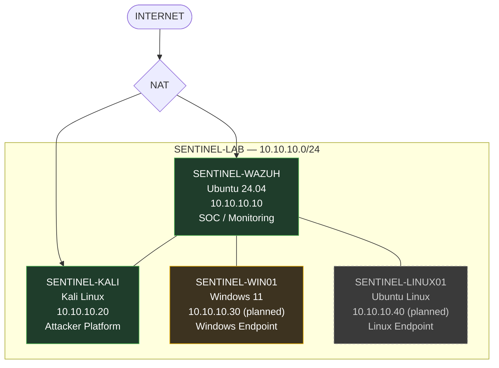
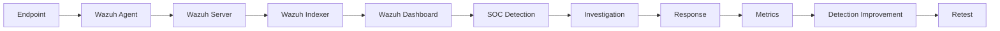
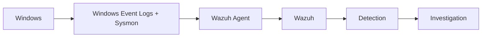
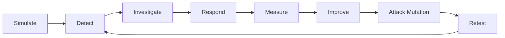

# SENTINEL Architecture

> **"Does your detection still work when the attacker changes tactics?"**

SENTINEL is a private, isolated virtual cybersecurity SOC laboratory built to simulate a small enterprise environment. It exists to generate controlled attacks, collect real telemetry, engineer detections against that telemetry, investigate the resulting alerts, respond to simulated incidents, measure defensive performance, and then deliberately mutate attacker behavior to retest whether those defenses hold.

SENTINEL is not a Wazuh installation. Wazuh is one component inside a larger security validation lifecycle:

```
SIMULATE → DETECT → INVESTIGATE → RESPOND → MEASURE → IMPROVE → RETEST
```

This document describes that lifecycle, the infrastructure that supports it, and — explicitly — what is currently operational versus what is planned.

---

## Architecture Philosophy

Most home SOC labs stop at "I installed a SIEM and generated an alert." SENTINEL is designed around a different question: **does a detection survive contact with an attacker who adapts?**

Every scenario in SENTINEL is intended to follow the same end-to-end chain:

```
Attack → Telemetry → Detection → Alert → Investigation →
MITRE ATT&CK Mapping → Evidence / IOCs → Response →
Measurement → Detection Improvement → Attack Mutation → Retest
```

The project treats detections as things that must be *proven*, not assumed — and treats missed detections and false positives as data, not failures to hide.

---

## 1. High-Level Architecture



**Legend:** solid green = operational · amber = in progress · dashed grey = planned.

### ASCII Network Topology

```text
                         INTERNET
                            |
                           NAT
                            |
        +-------------------+-------------------+
        |                                       |
+------------------+                    +------------------+
| SENTINEL-WAZUH   |                    | SENTINEL-KALI    |
| SOC / Monitoring |                    | Attacker         |
| Ubuntu 24.04     |                    | Kali Linux       |
| 10.10.10.10      |                    | 10.10.10.20      |
| [OPERATIONAL]    |                    | [OPERATIONAL]    |
+--------+---------+                    +--------+---------+
         |                                        |
         +----------------+-----------------------+
                          |
                   SENTINEL-LAB
                 10.10.10.0/24
                          |
                  +-------+-------+
                  |               |
          +---------------+ +-------------------+
          | SENTINEL-WIN01| | SENTINEL-LINUX01  |
          | Windows 11    | | Ubuntu Linux       |
          | 10.10.10.30   | | 10.10.10.40        |
          | [IN PROGRESS] | | [PLANNED]          |
          +---------------+ +-------------------+
```

---

## 2. Virtual Machine Architecture

### 2.1 SENTINEL-WAZUH

| Field | Value |
|---|---|
| Role | Central SOC / security monitoring platform |
| OS | Ubuntu 24.04 |
| Lab IP | `10.10.10.10` |
| Resources | 4 vCPU · 8 GB RAM · ~50 GB disk |
| Network | NAT + SENTINEL-LAB |
| **Status** | **OPERATIONAL** |

Verified:
- [x] Ubuntu 24.04 installed
- [x] Wazuh all-in-one deployment (server, indexer, dashboard) completed
- [x] Wazuh Dashboard opened and authentication verified
- [x] SENTINEL-LAB interface configured at `10.10.10.10`

Wazuh is intended to provide endpoint telemetry collection, event analysis, alerting, detection engineering, centralized monitoring, investigation support, and dashboarding. No production-grade detection content has been built yet — this is infrastructure only.

### 2.2 SENTINEL-KALI

| Field | Value |
|---|---|
| Role | Controlled attacker / adversary simulation platform |
| OS | Kali Linux |
| Lab IP | `10.10.10.20` |
| Network | NAT + SENTINEL-LAB |
| **Status** | **OPERATIONAL** |

Verified:
- [x] Kali Linux VM deployed
- [x] NAT internet connectivity verified
- [x] SENTINEL-LAB interface configured at `10.10.10.20`
- [x] Successful ping to SENTINEL-WAZUH (`10.10.10.10`)

Kali is intended for controlled reconnaissance, enumeration, attack simulation, adversary emulation, exploitation simulation, attack variation, and detection validation. No specific attack scenario has been executed yet.

### 2.3 SENTINEL-WIN01

| Field | Value |
|---|---|
| Role | Primary Windows endpoint / detection target |
| OS | Windows 11 |
| Planned lab IP | `10.10.10.30` |
| Network | NAT + SENTINEL-LAB |
| **Status** | **DEPLOYMENT / BOOT TROUBLESHOOTING IN PROGRESS** |

Configuration applied so far:
- 4 GB RAM, 2 vCPUs
- UEFI, Secure Boot, TPM 2.0
- VBoxSVGA, 128 MB video memory, 3D acceleration disabled
- NAT + SENTINEL-LAB adapters
- ~68 GB dynamically allocated disk

Current blocker: VirtualBox renders a gray window with a small black guest display area; boot/display is not yet resolved.

Not yet true: Windows is **not** operational, Sysmon is **not** installed, the Wazuh Windows agent is **not** installed, and no Windows telemetry is being collected. Planned telemetry sources: Wazuh Agent, Sysmon, Windows Event Logs — for scenarios covering PowerShell execution, process execution, suspicious commands, persistence, authentication activity, and mapped MITRE ATT&CK techniques.

### 2.4 SENTINEL-LINUX01

| Field | Value |
|---|---|
| Role | Linux endpoint |
| Planned OS | Ubuntu Linux |
| Planned lab IP | `10.10.10.40` |
| **Status** | **PLANNED** |

Intended to expand SENTINEL beyond Windows with Linux-native detection and investigation scenarios. No deployment work has started.

---

## 3. Network Architecture

Two conceptual network paths are in use:

| Path | Purpose |
|---|---|
| **NAT** | Controlled internet access for updates, package installs, and downloading legitimate security tooling |
| **SENTINEL-LAB** (`10.10.10.0/24`) | Isolated internal VirtualBox network for inter-lab communication and all attack traffic |

### Current Addressing Plan

| Host | IP | Status |
|---|---|---|
| SENTINEL-WAZUH | 10.10.10.10 | Deployed & connectivity-tested |
| SENTINEL-KALI | 10.10.10.20 | Deployed & connectivity-tested |
| SENTINEL-WIN01 | 10.10.10.30 | Planned/in progress |
| SENTINEL-LINUX01 | 10.10.10.40 | Planned |

Only Wazuh and Kali have been fully deployed and tested on SENTINEL-LAB so far.

---

## 4. Security Boundary

SENTINEL is a **closed laboratory**. The scope boundary is intentionally strict:

- All attack simulations occur **only** within SENTINEL-LAB (`10.10.10.0/24`).
- The real Windows host running VirtualBox is **not** a SENTINEL target and is never attacked.
- NAT is used **only** for legitimate connectivity (updates, tool downloads) — never as an attack path.
- No traffic is directed at the user's real LAN or public internet targets.

---

## 5. Telemetry Architecture



Windows-specific path (planned):



None of the endpoint telemetry stages beyond Wazuh's own dashboard are active yet — this describes the intended, not current, data flow.

---

## 6. SOC Detection Architecture

Detections in SENTINEL are meant to be engineered directly against captured telemetry rather than assumed from default rule sets. A detection is only considered valid once it has fired against a real, executed attack in the lab and its performance has been recorded (see [Section 11](#11-detection-metrics)).

---

## 7. Investigation Architecture

Every confirmed scenario is intended to eventually produce a structured case report:

- Incident Summary
- Severity
- Affected Assets
- Timeline
- Initial Detection
- Evidence
- IOCs
- MITRE ATT&CK Mapping
- Investigation
- Root Cause
- Response
- Detection Performance
- Failure / False Positive Analysis
- Improvements
- Retest Results
- Lessons Learned

No case report exists yet (no "Case 001" has been created).

---

## 8. Incident Response Architecture

Response in SENTINEL is human-in-the-loop containment practiced inside the lab boundary — not automated remediation. Response procedures will be documented per-scenario once the first detections exist.

---

## 9. Purple-Team Feedback Loop



SENTINEL is designed as a continuous loop, not a one-time exercise: every retest either confirms a detection holds or feeds back into another improvement cycle.

---

## 10. Attack DNA and Mutation

SENTINEL's signature concept treats an attack as **Attack DNA** — a sequence of behaviors and events across an attack chain (e.g., initial execution → discovery → persistence), rather than a single static payload.

**Attack Mutation** means deliberately altering *how* an objective is achieved (different tooling, encoding, timing, or technique) while preserving the underlying objective, then retesting the same detection against the mutated version. A detection is only considered resilient once it survives at least one mutation of the original attack.

---

## 11. Detection Metrics

Metrics are intended to measure detections, not just count alerts:

| Metric | Purpose |
|---|---|
| Scenario / Technique | What was tested |
| MITRE ATT&CK Technique | Standardized mapping |
| Attack Executions | How many times the attack ran |
| Successful Detections | Times the detection fired correctly |
| Missed Detections | Times the attack went undetected |
| False Positives | Non-malicious activity incorrectly flagged |
| Detection Rate | Successful detections ÷ executions |
| Detection Time | Time from attack to alert |
| Response Time | Time from alert to containment action |
| Before/After Tuning | Detection performance pre- and post-improvement |

No metrics have been collected yet — this is the model that will be populated once scenarios exist.

---

## 12. Evidence Architecture

```text
evidence/
├── v0.1/
├── v0.2/
├── v0.3/
├── v0.4/
├── v0.5/
└── v0.6/
```

Each version folder will eventually hold real artifacts only — screenshots, Wazuh alerts, detection test results, investigation notes, metrics, attack evidence, and response evidence. No fabricated evidence will be added.

---

## 13. Project Roadmap

| Version | Focus | Includes |
|---|---|---|
| **v0.1 — Foundation** | Infrastructure | Virtual SOC infra, isolated network, Wazuh, attacker VM, endpoint deployment |
| **v0.2 — Detection Engineering** | Telemetry & detections | First detections, testing, tuning |
| **v0.3 — SOC Investigation** | Case workflow | Incident cases, timelines, IOCs, MITRE ATT&CK, threat hunting |
| **v0.4 — Response** | Containment | Response procedures, human-in-the-loop actions |
| **v0.5 — Purple Team + Metrics** | Measurement | Detection performance, false positives, missed detections, timing metrics |
| **v0.6 — Attack DNA + Mutation** | Resilience testing | Attack chains, variation, mutation, retesting |
| **v1.0 — Integrated SENTINEL** | Conceptual target | Full lifecycle integrated end-to-end *(not yet built)* |

SENTINEL is currently in **v0.1 — Foundation**.

---

## 14. Current Implementation Status

**Operational**
- [x] SENTINEL-WAZUH deployed (Wazuh all-in-one, dashboard verified)
- [x] SENTINEL-LAB internal network created
- [x] SENTINEL-KALI deployed
- [x] Kali → Wazuh lab connectivity verified
- [x] VirtualBox upgraded to 7.2.20

**In Progress**
- [ ] SENTINEL-WIN01 deployment (boot/display troubleshooting)
- [ ] Windows telemetry pipeline (Sysmon, Wazuh Windows agent)

**Planned**
- [ ] SENTINEL-LINUX01
- [ ] First controlled attack scenario (PowerShell execution family)
- [ ] Detection engineering
- [ ] SOC investigations / case reports
- [ ] Incident response procedures
- [ ] Threat hunting
- [ ] Detection metrics collection
- [ ] Purple-team validation
- [ ] Attack mutation and retesting

> **Implementation note:** VirtualBox is currently operating through the Windows hypervisor/NEM path (due to Windows VBS), which reduces virtualization performance. This is a known constraint, not a core architectural feature.

---

## 15. Security and Laboratory Rules

- Attack only systems inside SENTINEL-LAB.
- Never attack external systems, the real host, or the LAN.
- No real credentials or secrets are used anywhere in the lab.
- No passwords, tokens, API keys, certificates, or private keys are committed to the repository.
- VM disk files are never committed.
- Raw, sensitive telemetry is not uploaded.
- All simulations remain inside authorized laboratory boundaries at all times.

---

## 16. Future Expansion

Beyond v1.0, potential directions include additional endpoint diversity (more Linux variants, cloud-hosted targets), a wider MITRE ATT&CK technique library, and deeper automation of the measure → improve → retest cycle. No AI/ML, blockchain, or unrelated buzzword technologies are planned or implied — SENTINEL's value is the validated detection lifecycle itself, not the tooling around it.

---

## Closing

SENTINEL is not a checklist of installed tools. It is a lifecycle:

```
ATTACK → TELEMETRY → DETECTION → INVESTIGATION → RESPONSE →
MEASUREMENT → IMPROVEMENT → ATTACK MUTATION → RETEST
```

**Does your detection still work when the attacker changes tactics?**
