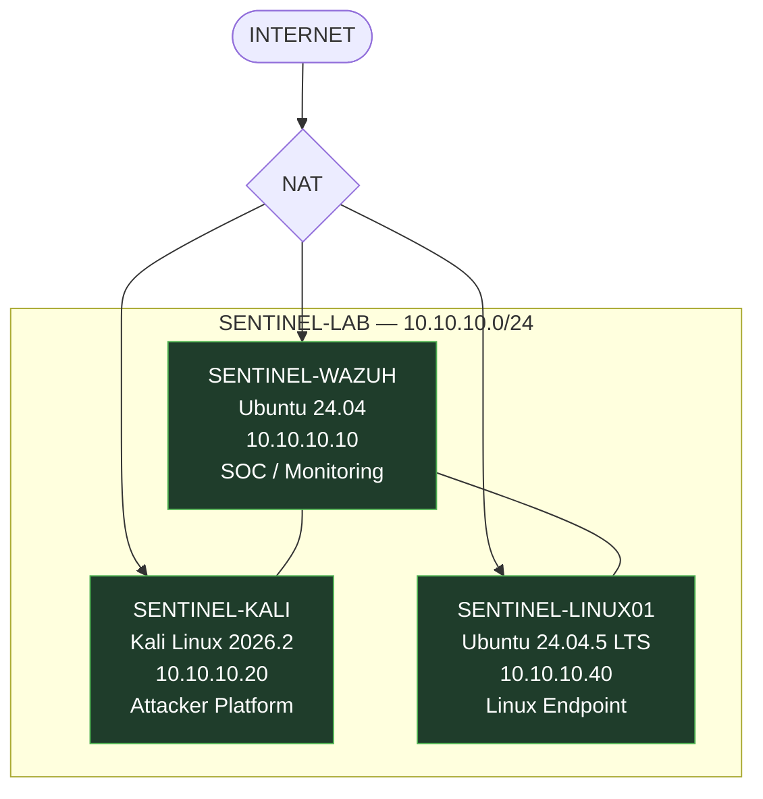
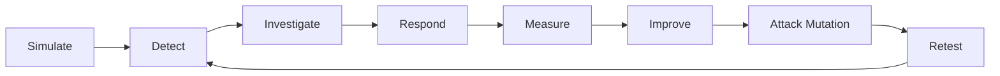

# SENTINEL Architecture

> **Does your detection still work when the attacker changes tactics?**

SENTINEL is a private, isolated virtual cybersecurity SOC laboratory. It is designed to simulate controlled attacks, collect security telemetry, engineer detections, investigate alerts, respond to simulated incidents, measure defensive performance, improve detections, mutate attacker behavior, and retest detection resilience.

SENTINEL is not merely a Wazuh installation. Wazuh is the central security monitoring and detection platform inside a broader validation lifecycle:

```
SIMULATE → DETECT → INVESTIGATE → RESPOND → MEASURE → IMPROVE → RETEST
```

This document describes the architecture as it currently exists and, separately, the architecture it is designed to grow into.

---

## 1. Architecture Philosophy

Most basic home SOC labs stop at:

```
Attack → Alert → Screenshot
```

SENTINEL is designed around a longer chain:

```
Attack → Telemetry → Detection → Alert → Investigation →
MITRE ATT&CK Mapping → Evidence / IOCs → Response →
Measurement → Detection Improvement → Attack Mutation → Retest
```

Detections are treated as engineering hypotheses that must be tested against real activity, not assumed to work by default. A missed detection or false positive is engineering evidence for improvement, not something to hide. This is the project's design philosophy — the sections below make clear which parts of it are already built and which are still ahead.

---

## 2. High-Level Architecture

The current operational lab consists of **three VMs**: SENTINEL-WAZUH, SENTINEL-KALI, and SENTINEL-LINUX01. There is currently no operational Windows endpoint — a Windows VM was originally planned but was set aside during v0.1 due to virtualization/boot issues, and Windows is now future expansion only (see [3.4](#34-future-windows--active-directory-expansion)).



**Status:** all three nodes shown above are operational.

---

## 3. Virtual Machine Architecture

### 3.1 SENTINEL-WAZUH

| Field | Value |
|---|---|
| Role | Central SOC / Wazuh monitoring and detection platform |
| OS | Ubuntu 24.04 |
| Resources | 4 vCPU · 8 GB RAM · ~50 GB dynamically allocated disk |
| Lab IP | `10.10.10.10` |
| Network | NAT + SENTINEL-LAB |
| Wazuh | All-in-one deployment, version 4.14.8, Dashboard operational |
| **Status** | **OPERATIONAL** |

Verified:
- [x] Ubuntu 24.04 deployed
- [x] Wazuh all-in-one installed
- [x] Wazuh Dashboard accessible, authentication verified
- [x] SENTINEL-LAB interface configured at `10.10.10.10`
- [x] Connectivity to SENTINEL-LINUX01 verified

### 3.2 SENTINEL-KALI

| Field | Value |
|---|---|
| Role | Controlled attacker / adversary-simulation platform |
| OS | Kali Linux 2026.2 |
| Resources | 2 vCPU · ~4 GB RAM · ~80 GB virtual disk |
| Lab IP | `10.10.10.20` |
| Network | NAT + SENTINEL-LAB |
| **Status** | **OPERATIONAL** |

Verified:
- [x] Kali VM deployed
- [x] NAT connectivity verified
- [x] SENTINEL-LAB interface configured at `10.10.10.20`
- [x] Kali can communicate with SENTINEL-WAZUH

No specific attack scenario has been executed yet — Kali has not generated any alerts or completed attacks against the lab so far.

### 3.3 SENTINEL-LINUX01

| Field | Value |
|---|---|
| Role | Linux endpoint / detection target |
| OS | Ubuntu 24.04.5 LTS |
| Resources | 2 vCPU · 4 GB RAM · 40 GB dynamically allocated disk |
| Lab IP | `10.10.10.40` |
| Network | NAT + SENTINEL-LAB |
| Wazuh Agent | Version 4.14.8, Agent ID `001`, status **Active**, service enabled and running |
| **Status** | **OPERATIONAL** |

Verified:
- [x] Ubuntu 24.04.5 LTS deployed
- [x] Lab IP `10.10.10.40` configured
- [x] Connectivity to SENTINEL-WAZUH verified
- [x] Wazuh Agent installed and registered
- [x] Agent visible in Wazuh Dashboard with status Active
- [x] Agent configured to start automatically

Detailed Linux telemetry configuration and detection engineering have **not** yet been completed — those are v0.2 work.

### 3.4 Future Windows / Active Directory Expansion

**Status: FUTURE — not part of current architecture.**

Windows is not deployed anywhere in the lab, and `10.10.10.30` is not currently assigned to any host. A future phase may introduce a Windows endpoint, and potentially an Active Directory environment, to expand the lab with:

- Windows Event Log coverage
- Sysmon telemetry
- Windows authentication scenarios
- PowerShell telemetry
- Enterprise identity scenarios

No Windows deployment work is currently underway.

---

## 4. Network Architecture

**Lab network:** `SENTINEL-LAB` — `10.10.10.0/24`, an isolated VirtualBox Internal Network.

| Host | Role | Lab IP | Status |
|---|---|---|---|
| SENTINEL-WAZUH | SOC / Wazuh | 10.10.10.10 | Operational |
| SENTINEL-KALI | Attacker | 10.10.10.20 | Operational |
| SENTINEL-LINUX01 | Linux Endpoint | 10.10.10.40 | Operational |

Two separate network paths are used:

- **NAT** — legitimate outbound Internet/package access when required.
- **SENTINEL-LAB** — isolated internal network for communication between lab systems and all controlled attack traffic.

```text
                    INTERNET
                       |
                      NAT
                       |
              +----------------+
              | SENTINEL-WAZUH |
              | 10.10.10.10    |
              | Wazuh SOC      |
              +----------------+
                       |
                SENTINEL-LAB
                10.10.10.0/24
                  /          \
                 /            \
      +----------------+  +-------------------+
      | SENTINEL-KALI  |  | SENTINEL-LINUX01  |
      | 10.10.10.20    |  | 10.10.10.40       |
      | Attacker       |  | Linux Endpoint    |
      +----------------+  +-------------------+
```

---

## 5. Security Boundary

- All attack simulations remain inside SENTINEL-LAB.
- The real Windows host and real LAN are never attacked.
- NAT is used only for legitimate connectivity, never attack traffic.
- No real credentials are used anywhere in the lab.
- No secrets are stored in GitHub.
- VM disks are not committed to the repository.
- Sensitive raw telemetry is not uploaded.
- All testing occurs only against owned or explicitly authorized lab systems.

---

## 6. Telemetry Architecture

Current, verified telemetry path:


The agent is currently connected and reports status Active.

**Current:** Agent → Wazuh → Dashboard.

**Planned:** Telemetry → Detection → Investigation → Response → Measurement → Retest.

Detailed Linux telemetry configuration (authentication logs, SSH activity, File Integrity Monitoring, etc.), detection engineering, and any controlled attack execution have not yet been completed. No production or custom detection content has been validated, and investigation and response workflows remain planned.

---

## 7. SOC Detection Architecture

**Planned detection-engineering methodology** — detections are intended to be validated by:

1. Executing a controlled scenario.
2. Confirming relevant telemetry was captured.
3. Confirming the detection fires.
4. Investigating the resulting alert.
5. Measuring performance.
6. Modifying the detection if required.
7. Retesting.

No detections have been built or validated under this methodology yet.

---

## 8. Investigation Architecture

Every confirmed scenario is intended to eventually produce a structured case report:

- Incident Summary
- Severity
- Affected Assets
- Timeline
- Initial Detection
- Evidence
- IOCs
- MITRE ATT&CK Mapping
- Investigation
- Root Cause
- Response
- Detection Performance
- Failure / False Positive Analysis
- Improvements
- Retest Results
- Lessons Learned

No case report exists yet — there is no "Case-001," and no investigation has occurred.

---

## 9. Incident Response Architecture

Intended architecture: **human-in-the-loop response** performed inside the isolated laboratory. No automated remediation currently exists. Response procedures will be developed after detection and investigation capabilities are established in later phases.

---

## 10. Purple-Team Feedback Loop



**Status: PLANNED / FUTURE PHASES.** This is the project's intended continuous validation loop — not something currently running.

---

## 11. Attack DNA and Mutation

**Attack DNA** (planned, v0.6) represents an attack as a behavioral sequence across an attack chain, rather than a single payload or alert:

```
Initial Access / Execution
        ↓
Discovery
        ↓
Persistence
        ↓
Credential / Privilege Activity
        ↓
Lateral Movement
        ↓
Impact
```

Not every scenario will necessarily include every stage.

**Attack Mutation** (planned, v0.6) means changing *how* an attacker achieves an objective — different execution method, command structure, tooling, encoding/obfuscation, or timing — while preserving the underlying objective, in order to test whether a detection is behaviorally resilient. Attack mutation is not implemented yet.

---

## 12. Detection Metrics

Planned metrics model:

| Metric | Purpose |
|---|---|
| Scenario / Technique | What was tested |
| MITRE ATT&CK Technique | Standardized mapping |
| Attack Executions | Number of executions |
| Successful Detections | Correct detections |
| Missed Detections | Undetected executions |
| False Positives | Incorrect alerts |
| Detection Rate | Successful detections ÷ executions |
| Detection Time | Attack → alert |
| Response Time | Alert → response |
| Before/After Tuning | Effect of improvements |

No detection metrics have been collected yet; no numbers are reported here. Metrics belong primarily to v0.5.

---

## 13. Evidence Architecture

```text
evidence/
├── v0.1/
├── v0.2/
├── v0.3/
├── v0.4/
├── v0.5/
└── v0.6/
```

Evidence consists of real project artifacts only. For **v0.1**, actual evidence includes:

- Wazuh Dashboard showing SENTINEL-LINUX01 registered
- Agent ID `001` and Active status
- Wazuh agent service status
- Infrastructure connectivity verification

No attack screenshots or detection alerts exist yet.

---

## 14. Project Roadmap

| Version | Focus | Status |
|---|---|---|
| v0.1 | Foundation | **COMPLETED** |
| v0.2 | Detection Engineering & Linux Telemetry | NEXT |
| v0.3 | SOC Investigation | PLANNED |
| v0.4 | Incident Response | PLANNED |
| v0.5 | Purple-Team Measurement | PLANNED |
| v0.6 | Attack DNA & Mutation | PLANNED |
| v1.0 | Integrated SENTINEL | FUTURE TARGET |

- **v0.2** introduces Linux security telemetry configuration and the first engineered, validated detections.
- **v0.3** introduces SOC investigation workflows: timelines, evidence, IOCs, MITRE ATT&CK mapping, case reports.
- **v0.4** introduces human-in-the-loop incident response procedures.
- **v0.5** introduces measurement of detection and response performance.
- **v0.6** introduces Attack DNA modeling and attack mutation to test detection resilience.
- **v1.0** is the conceptual target of a fully integrated lifecycle — not yet built.

No completion percentages are assigned; status is tracked qualitatively.

---

## 15. Current Implementation Status

**Operational**
- [x] SENTINEL-WAZUH deployed
- [x] Wazuh all-in-one installed
- [x] Wazuh Dashboard verified
- [x] SENTINEL-LAB created
- [x] SENTINEL-KALI deployed
- [x] SENTINEL-LINUX01 deployed
- [x] Linux01 configured at 10.10.10.40
- [x] Wazuh Agent 4.14.8 installed
- [x] Agent ID 001 registered
- [x] Agent status Active
- [x] Agent enabled at boot
- [x] Wazuh ↔ Linux01 connectivity verified

**Next**
- [ ] Configure Linux security telemetry
- [ ] Define first controlled attack scenario
- [ ] Engineer first detection
- [ ] Validate detection
- [ ] Begin SOC investigation workflow

**Future**
- [ ] Windows endpoint
- [ ] Active Directory
- [ ] Sysmon
- [ ] Expanded endpoint diversity
- [ ] Attack mutation
- [ ] Custom SENTINEL console
- [ ] Additional automation

---

## 16. Security and Laboratory Rules

- All attack simulations remain inside SENTINEL-LAB.
- Never attack external systems.
- Never attack the real Windows host.
- Never attack the real LAN.
- NAT is for legitimate connectivity only, never attack traffic.
- No real credentials are used anywhere in the lab.
- No secrets are stored in GitHub.
- VM disks are never committed.
- Sensitive raw telemetry is never uploaded.
- All testing occurs only against owned or explicitly authorized systems.

**Host / virtualization note:** the lab runs in Oracle VirtualBox 7.2.20 on a Windows 11 host. The host's Windows virtualization/VBS infrastructure may affect VM performance; this is an implementation constraint of the development environment, not part of SENTINEL's security architecture.

---

## 17. Future Expansion

Beyond the current roadmap, potential future directions include a Windows/Active Directory endpoint, Sysmon telemetry, expanded Linux/endpoint diversity, deeper DFIR and case-management tooling, and a custom SENTINEL console consuming live Wazuh data. None of these are committed or in progress — they will only be pursued if they solve a demonstrated project need.

---

## 18. Closing

SENTINEL v0.1 established a working, isolated three-node lab: a SOC monitoring platform, an attacker platform, and a Linux endpoint reporting live telemetry. The next phases build the actual detection and validation lifecycle on top of that foundation.

**Does your detection still work when the attacker changes tactics?**
