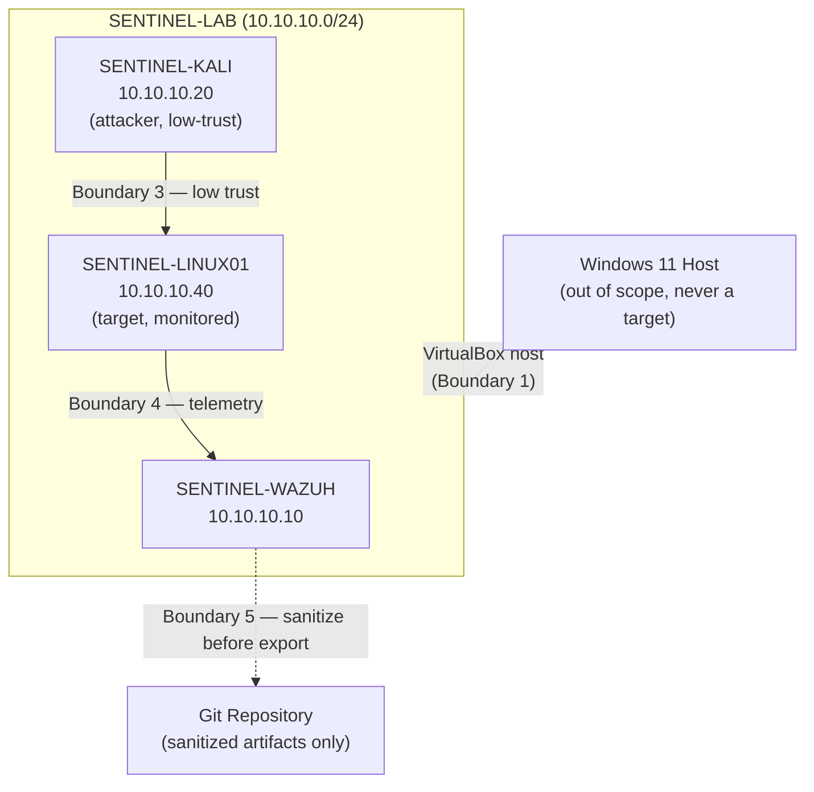
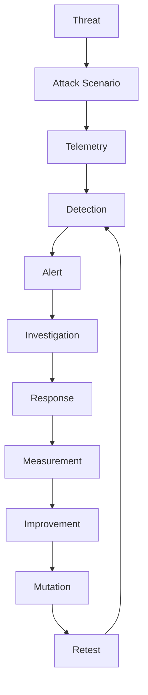

# SENTINEL Threat Model

> Does your detection still work when the attacker changes tactics?

This is the **initial threat model** for SENTINEL v0.1. It is a planning document, not an attack report: it establishes what the lab is defending, who the assumed attacker is, where the trust boundaries sit, and which threats are candidates for future controlled testing. No attacks have been executed against SENTINEL yet, and no detections have been validated — this document exists to guide that work, not to describe it as done.

---

## 1. Purpose

This threat model exists to:

1. Identify the assets that matter in SENTINEL.
2. Identify the trust boundaries between lab components.
3. Identify what an attacker operating inside the lab could realistically attempt.
4. Identify realistic attack surfaces given the current architecture.
5. Identify threat categories relevant to the lab.
6. Make assumptions and constraints explicit.
7. Prioritize threats for future testing.
8. Translate prioritized threats into concrete detection-engineering scenarios.
9. Provide a repeatable foundation that later SENTINEL versions build on.

This document is expected to evolve as the architecture grows (new endpoints, new trust boundaries, new capabilities).

---

## 2. Current Architecture Context

SENTINEL v0.1 — Foundation is **completed**. The current operational lab consists of three VMs on an isolated internal network, `SENTINEL-LAB` (`10.10.10.0/24`):

| Host | Role | OS | Lab IP | Status |
|---|---|---|---|---|
| SENTINEL-WAZUH | SOC / monitoring / detection platform | Ubuntu 24.04 (Wazuh 4.14.8) | 10.10.10.10 | Operational |
| SENTINEL-KALI | Controlled attacker / adversary-simulation platform | Kali Linux 2026.2 | 10.10.10.20 | Operational |
| SENTINEL-LINUX01 | Linux endpoint / detection target | Ubuntu 24.04.5 LTS (Wazuh Agent 4.14.8, Agent ID 001, status Active) | 10.10.10.40 | Operational |

```text
                    INTERNET
                       |
                      NAT
                       |
              +----------------+
              | SENTINEL-WAZUH |
              | 10.10.10.10    |
              | SOC / Wazuh    |
              +----------------+
                       |
                SENTINEL-LAB
                10.10.10.0/24
                  /          \
                 /            \
      +----------------+  +-------------------+
      | SENTINEL-KALI  |  | SENTINEL-LINUX01  |
      | 10.10.10.20    |  | 10.10.10.40       |
      | Attacker       |  | Target            |
      +----------------+  +-------------------+
```

**Current limitations relevant to this threat model:**

- No controlled attack scenario has been executed yet.
- No custom detection has been validated yet.
- Detailed Linux telemetry engineering is not yet complete.
- No incident has been investigated, and no incident response procedure has been tested.
- No detection-performance metrics exist yet.
- Attack mutation, Attack DNA, and purple-team validation are not implemented.

**Windows is not part of the current architecture.** No Windows host exists in the lab today. A **Future Windows / Active Directory Expansion** may later introduce Windows authentication, PowerShell activity, Windows Event Logs, Sysmon telemetry, and Active Directory identity scenarios — these are noted where relevant below but are explicitly future, not current, attack surfaces.

---

## 3. Security Objectives

### Confidentiality
Protect credentials, secrets, telemetry, investigation evidence, and other project data from unauthorized disclosure.

### Integrity
Protect detection rules, Wazuh configuration, collected logs, evidence, and project documentation from unauthorized or unnoticed modification.

### Availability
Keep the SOC monitoring platform and endpoint telemetry pipeline operational enough to conduct testing when needed.

### Detection Integrity
Ensure that detections represent meaningful malicious activity and are not silently broken, silently disabled, or excessively noisy to the point of being ignored.

### Evidence Integrity
Ensure investigation evidence can be attributed to the correct scenario and is not accidentally altered, mixed up, or fabricated.

Detection integrity and evidence integrity carry particular weight in SENTINEL, since the project's entire value depends on being able to trust that a recorded detection result actually reflects what happened.

---

## 4. Asset Inventory

| Asset | Role | Security Importance | Current Status |
|---|---|---|---|
| Wazuh Manager | Central detection/monitoring engine | High — if compromised or misconfigured, undermines every other detection claim | Deployed, operational |
| Wazuh Dashboard | Analyst-facing interface into Wazuh | Medium-High — unauthorized access could expose alert data or allow tampering | Deployed, operational |
| Wazuh Indexer / stored security data | Storage for security events and alerts | High — integrity of stored data underpins investigation and metrics | Deployed, operational |
| SENTINEL-LINUX01 | Monitored Linux endpoint | Medium — the current target system for telemetry and future attack scenarios | Deployed, operational |
| Wazuh Agent (on Linux01) | Telemetry collection and forwarding | Medium-High — its integrity determines whether telemetry can be trusted | Installed, Active |
| SENTINEL-KALI | Attacker-controlled platform | Low (as an asset) — intentionally adversarial; matters mainly for containment | Deployed, operational |
| SENTINEL-LAB network | Isolated network connecting all lab nodes | High — the isolation boundary itself is a security-relevant asset | Configured, operational |
| Detection rules / configuration | Encodes what SENTINEL considers malicious | High — this is the artifact the whole project is meant to validate | None authored yet |
| Investigation evidence | Records of past scenarios and findings | Medium-High once it exists — false or altered evidence undermines the project's credibility | Not yet produced |
| Future case reports | Structured incident documentation | Medium-High once produced | Not yet produced |
| Git repository / project documentation | Source of truth for the project's design and history | Medium — must not leak secrets or misrepresent project state | In use |

None of these assets are treated as more critical than the lab's actual scope warrants — SENTINEL is a personal isolated lab, not production infrastructure, so importance ratings above are relative to the project's own goals rather than an enterprise risk register.

---

## 5. Trust Boundaries

### Boundary 1 — Host ↔ Virtual Lab
The Windows 11 host runs Oracle VirtualBox but sits outside the SENTINEL attack scope entirely. The host is never a target and must not be attacked, even accidentally, during any future scenario.

### Boundary 2 — NAT ↔ SENTINEL-LAB
NAT provides controlled outbound Internet connectivity (updates, package installs). SENTINEL-LAB is the isolated internal environment where all lab-to-lab communication and all attack traffic is intended to stay. NAT is not an attack path.

### Boundary 3 — Attacker ↔ Target
SENTINEL-KALI is intentionally attacker-controlled. SENTINEL-LINUX01 is the current endpoint under observation. This relationship is deliberately low-trust: everything the "attacker" node does toward the target is treated as adversarial by design.

### Boundary 4 — Endpoint ↔ SOC
SENTINEL-LINUX01 sends telemetry through the Wazuh Agent to SENTINEL-WAZUH. This telemetry channel must be treated as security-relevant: if it were altered or dropped, downstream detections would be unreliable.

### Boundary 5 — SOC Data ↔ Evidence / Repository
Wazuh data and investigation evidence may eventually be transformed into sanitized project artifacts for the Git repository. Raw Wazuh data, credentials, and unsanitized telemetry must never cross this boundary into the public/private repository as-is.



---

## 6. Attacker Model

The assumed attacker is a **controlled adversary operating from SENTINEL-KALI**, acting within the lab's authorized scope. The attacker may eventually:

- Perform reconnaissance
- Enumerate services
- Attempt authentication attacks
- Execute commands on the target
- Discover local system information
- Modify files
- Establish persistence where appropriate
- Attempt privilege escalation
- Generate network activity
- Vary execution methods
- Mutate behavior while preserving the underlying objective

**These are candidate capabilities to be tested in future phases — none of them have been exercised against SENTINEL-LINUX01 yet.**

---

## 7. Attacker Capability Levels

### Level 1 — Basic
- Network discovery
- Service enumeration
- Simple authentication attempts
- Basic command execution

### Level 2 — Intermediate
- Multi-step attack chains
- Credential-related activity
- Persistence attempts
- Privilege escalation attempts
- Tool variation

### Level 3 — Adaptive
- Obfuscation
- Encoding
- Timing changes
- Alternative tooling
- Modified execution chains
- Attack mutation

Level 3 corresponds to the project's future detection-resilience testing (v0.6 and beyond). No capability level has been implemented or tested yet — this model exists to scope future scenario design.

---

## 8. Attack Surface

**Current attack surfaces:**

### SENTINEL-LAB network
Potential network reconnaissance and service discovery across the internal `10.10.10.0/24` network.

### Linux endpoint (SENTINEL-LINUX01)
Potential surfaces include authentication activity, SSH, process execution, file changes, privilege-related activity, and system configuration changes.

### Wazuh Agent
Potential surfaces include agent communication, agent configuration, and telemetry integrity.

### Wazuh SOC (SENTINEL-WAZUH)
Potential surfaces include the management/dashboard interface, detection configuration, stored security data, and analyst access.

### NAT
Provides outbound connectivity but is **not** an intended attack path and is not treated as part of the lab's internal attack surface.

The current attack surface is intentionally narrow, since the lab is isolated and only one endpoint is deployed. It will expand as future endpoints (e.g., Windows, additional Linux systems) are added.

---

## 9. Threat Categories

| Threat | Target | Attacker Goal | Potential Impact | Planned Validation |
|---|---|---|---|---|
| Network reconnaissance | SENTINEL-LAB | Map hosts and services | Informs later attack steps | Future scenario |
| Service enumeration | SENTINEL-LINUX01 | Identify exposed services | Informs later attack steps | Future scenario |
| Authentication attacks | SENTINEL-LINUX01 | Gain unauthorized access | Unauthorized login | Future scenario |
| Unauthorized command execution | SENTINEL-LINUX01 | Execute attacker-controlled commands | Local compromise | Future scenario |
| Privilege escalation | SENTINEL-LINUX01 | Gain elevated privileges | Broader system control | Future scenario |
| Persistence | SENTINEL-LINUX01 | Maintain access across reboots/sessions | Long-term foothold | Future scenario |
| File/system modification | SENTINEL-LINUX01 | Alter system state or files | Integrity loss | Future scenario |
| Credential-related activity | SENTINEL-LINUX01 | Harvest or misuse credentials | Broader compromise | Future scenario |
| Defense evasion | SENTINEL-LINUX01 / Wazuh Agent | Avoid detection | Undetected activity | Future scenario |
| Telemetry manipulation | Wazuh Agent | Disrupt or falsify telemetry | Loss of detection integrity | Future scenario |
| Wazuh configuration tampering | SENTINEL-WAZUH | Weaken or disable detections | Loss of detection integrity | Future scenario |
| Evidence tampering | Investigation evidence / repository | Misrepresent scenario outcomes | Loss of project credibility | Process control, not a technical scenario |
| Data exfiltration simulation | SENTINEL-LINUX01 → SENTINEL-KALI | Simulate data movement out of the target | Demonstrates exfil-detection gaps | Future scenario |
| Denial-of-service / resource exhaustion | Any lab VM | Degrade availability | Lab downtime | Low priority, limited educational value |

Not every threat listed here needs to become an actual test scenario. Scenario selection favors what is realistic, safe, and educational over exhaustive coverage, and destructive attack instructions are out of scope for this document.

---

## 10. Threat Prioritization

Threats are prioritized qualitatively as **High / Medium / Low**, based on:

- Relevance to SOC detection engineering
- Feasibility within the current lab
- Educational/learning value
- Availability of telemetry to observe the behavior
- Potential impact on the lab if things go wrong
- Ability to validate and later mutate a detection for it

No numerical risk scores are assigned, since there is no defined scoring methodology in place. A threat marked "High" here is high-priority for SENTINEL's learning and detection-engineering goals — not a claim about real-world danger outside this lab.

| Threat | Priority | Rationale |
|---|---|---|
| Authentication-related activity | High | High telemetry availability, common real-world relevance, good first detection target |
| Suspicious command execution | High | Directly observable via process/telemetry, foundational for later scenarios |
| Network reconnaissance / discovery | Medium | Useful early scenario, moderate telemetry richness |
| File/system modification | Medium | Good candidate once File Integrity Monitoring is configured (v0.2) |
| Persistence / privilege escalation | Medium | More complex, better suited once basic detections exist |
| Telemetry / configuration tampering | Medium | Important for detection integrity, but requires mature baseline first |
| Data exfiltration simulation | Low | Lower near-term priority given limited network telemetry today |
| Denial-of-service / resource exhaustion | Low | Limited detection-engineering value relative to lab risk |

---

## 11. Initial Threat Priorities

For v0.1/early v0.2, realistic first testing candidates share these traits: they can be safely simulated, generate observable Linux telemetry, are useful for detection engineering, can eventually be mapped to MITRE ATT&CK, and can plausibly be mutated later. Candidates include:

- Reconnaissance / discovery activity
- Authentication-related activity
- Suspicious command execution
- File/system modification

**These are candidate scenarios only.** No first attack scenario has been finalized or selected yet.

---

## 12. MITRE ATT&CK Mapping

MITRE ATT&CK will eventually be used to standardize how observed behavior is classified, following this process:

```
Threat Scenario
      ↓
Observed Behavior
      ↓
MITRE ATT&CK Technique
      ↓
Telemetry Source
      ↓
Detection
      ↓
Investigation
      ↓
Response
      ↓
Retest
```

No specific technique IDs are assigned in this document. Technique mapping will be added once a specific scenario is designed and confidently matched to a technique, rather than forced onto a threat where the mapping would be a poor fit.

---

## 13. Detection Requirements Derived from Threats

| Threat | Required Telemetry | Future Detection Goal | Investigation Evidence |
|---|---|---|---|
| Authentication attack | Authentication logs, source IP, username, timestamp, repeated-attempt pattern | Flag anomalous or repeated failed/successful logins | Auth log excerpts, timestamps, source |
| Suspicious command execution | Process/activity telemetry, command context where available, user, timestamp | Flag unexpected or high-risk command patterns | Process telemetry, command context, user |
| File modification | File Integrity Monitoring telemetry, path, user, timestamp, change details | Flag unauthorized or unexpected file changes | FIM records, path, user, change diff |

None of these telemetry sources are fully configured yet on SENTINEL-LINUX01 — configuring them is v0.2 work. This table describes the target state, not the current one.

---

## 14. Threat → Detection → Response Loop



This is the core SENTINEL validation loop that this threat model feeds into: a threat identified here eventually becomes a scenario, then telemetry, then a detection that gets measured and, eventually, retested against a mutated version of the same threat.

---

## 15. Assumptions

- The lab systems are owned by, or explicitly authorized for, the person running SENTINEL.
- The attacker operates only from SENTINEL-KALI.
- SENTINEL-LAB remains an isolated internal network.
- The Windows host is outside the attack scope at all times.
- Internet connectivity is not required for attack execution inside the lab.
- Wazuh remains the central monitoring platform through v0.x.
- Security testing conducted in the lab is controlled and reversible.
- Evidence will be collected from actual executions, not fabricated.
- Future functionality is not treated as implemented until it has been validated.

---

## 16. Security Constraints

- No external targets.
- No real credentials.
- No production data.
- No intentional attacks against the host.
- No attacks against the real LAN.
- No public exposure of intentionally vulnerable systems.
- No secrets committed to GitHub.
- No fabricated evidence.
- No destructive testing without explicit containment and recovery planning.

---

## 17. Threat Model Limitations

Current v0.1 limitations that this threat model is honest about:

- Only Linux endpoint coverage exists — there is no Windows/AD coverage.
- Endpoint diversity is limited to a single monitored host.
- Detailed telemetry engineering (auth logs, FIM, etc.) is not yet complete.
- No validated detection scenarios exist yet.
- No real incident cases exist yet.
- No detection-performance metrics exist yet.
- No attack mutation testing has occurred yet.

This threat model will evolve as SENTINEL's architecture and capabilities expand — it reflects the current, narrow scope of v0.1 rather than a mature enterprise environment.

---

## 18. Future Expansion

Future additions to this threat model may include:

- Windows endpoint threats
- Active Directory threats
- Identity-based attacks
- PowerShell activity
- Sysmon telemetry
- Lateral movement
- Cloud security scenarios
- Additional Linux endpoints
- Deception / honeypot scenarios
- More advanced adversary emulation

All of the above are **future** considerations and are not part of the current threat surface.

---

## 19. Threat Model Maintenance

This document should be updated when:

- The architecture changes.
- A new asset is added.
- A new trust boundary appears.
- New attack surfaces are introduced.
- New attack scenarios are added.
- Detection coverage changes materially.
- Windows/AD is introduced.
- Cloud or other new infrastructure is added.
- A significant lesson learned changes one of the assumptions above.

This document should **not** be rewritten for every minor configuration change — it tracks meaningful shifts in scope and assumptions, not day-to-day lab activity.
