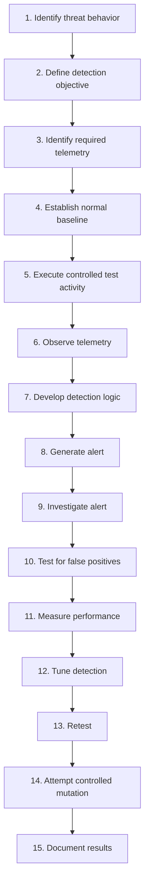

# SENTINEL Detection Engineering

> Does your detection still work when the attacker changes tactics?

This document defines how SENTINEL designs, implements, tests, tunes, measures, and improves security detections. It is both a methodology and, as of v0.2, a growing record of actual detections built against it. One detection — File Integrity Monitoring via Wazuh Syscheck — has been built, tested, and validated; see Section 21. No attack has been executed against SENTINEL: all testing to date has used controlled, non-adversarial activity (a direct file modification) to validate the detection pipeline, not adversary emulation. Where implementation status matters, it is marked explicitly as **CURRENT FOUNDATION**, **PLANNED**, **TESTED**, **VALIDATED**, or **FUTURE**.

SENTINEL does not treat a detection as successful merely because a rule exists. The validation model is:

```
Threat → Attack Scenario → Telemetry → Detection Logic → Alert →
Investigation → Validation → Measurement → Tuning → Retest
```

A detection is only considered validated once it has been tested against real controlled activity in the lab and the result has been documented.

---

## 1. Purpose

This document exists to define how SENTINEL develops detections that are:

- Observable — grounded in telemetry that actually exists
- Relevant — tied to a real threat, not written for its own sake
- Testable — validated against a controlled scenario, not assumed
- Explainable — an analyst can state why the detection fired
- Measurable — performance is recorded, not claimed
- Maintainable — documented well enough to update later
- Resistant to reasonable attacker variation — the eventual goal, not a guarantee

This is a methodology for building toward reliable detections; it does not claim any detection here is perfect or complete.

---

## 2. Detection Engineering Lifecycle



**Status: PARTIALLY EXECUTED.** This lifecycle has now been run, in reduced form, for SENTINEL's first detection (Section 21): identify behavior → telemetry → detection logic → controlled test → alert → validation → document. Steps 9–10 and 12–14 (full investigation, false-positive testing, tuning, retest, and mutation) have not yet been performed for this detection and remain open work for v0.2 continuation and later milestones.

---

## 3. Detection Design Requirements

Every detection should have a documented specification **before** implementation:

| Field | Description |
|---|---|
| Detection ID | Unique project identifier |
| Name | Human-readable detection name |
| Objective | What behavior should be detected |
| Threat | Threat being addressed (see `threat-modeling.md`) |
| Asset | Target system |
| MITRE ATT&CK | Technique/sub-technique where applicable |
| Telemetry Source | Required log/event source |
| Detection Logic | Conditions that should trigger the alert |
| Expected Context | What surrounding information matters for triage |
| Severity | Intended severity classification |
| False Positive Sources | Known legitimate behaviors that could trigger it |
| Test Scenario | Controlled scenario used for validation |
| Evidence | Supporting artifacts (screenshots, logs, alert output) |
| Status | Draft / Tested / Validated / Retired |

As of v0.2, one detection has been assigned a Wazuh rule ID — Rule `100002`, documented in Section 21 using this template. No MITRE ATT&CK technique has been mapped to it yet.

---

## 4. Telemetry-First Engineering

SENTINEL begins with telemetry, not with rules:

```
Behavior
  ↓
What evidence should exist?
  ↓
Which telemetry source contains it?
  ↓
Is the telemetry available?
  ↓
Is it reliable enough?
  ↓
Can the behavior be distinguished from normal activity?
  ↓
Design detection
```

A detection cannot compensate for telemetry that is missing, incomplete, or unreliable — if the underlying evidence isn't captured, no amount of rule-writing will make the detection trustworthy.

---

## 5. Baseline Before Detection

Understanding normal activity before tuning a detection reduces false positives and clarifies what "suspicious" actually means for this lab. Baseline areas of interest include:

- Normal authentication activity
- Normal process activity
- Normal file changes
- Normal system behavior
- Normal administrative activity

**Status: PLANNED.** No baseline observations have been formally recorded yet, including for the `/home` path monitored by the detection in Section 21. Baseline data collection remains open work for continued v0.2 activity.

---

## 6. Current Linux Telemetry Plan

The current target endpoint is **SENTINEL-LINUX01** (`10.10.10.40`). Planned telemetry areas:

### Authentication
- Successful authentication
- Failed authentication
- Repeated attempts
- Account activity

### Process / Command Activity
- Process execution
- Suspicious command patterns
- Execution context where available

### File / System Changes
- Important file modifications
- Configuration changes
- Integrity monitoring where appropriate — **implemented**: Wazuh Syscheck (File Integrity Monitoring) is now configured on `/home`; see Section 21.

### Network Activity
- Relevant connection activity
- Service exposure
- Suspicious connection patterns where observable

### Privilege / Identity Activity
- Privilege-related events
- Account changes
- Suspicious administrative behavior

**Current configuration status:** the Wazuh Agent (version 4.14.8, ID `001`, status Active) is connected and reporting, and Syscheck/FIM has been configured and validated on the `/home` path (Section 21). Authentication, process/command execution, network activity, and privilege/identity telemetry remain unconfigured and are still telemetry goals, not current configuration.

---

## 7. Detection Types

### Signature / Rule-Based
Detects known patterns or fixed conditions.

### Threshold / Frequency-Based
Detects repeated behavior over a defined time window.

### Correlation
Combines multiple events into a stronger, more reliable signal.

### Behavioral
Detects suspicious behavior patterns rather than one fixed string or event.

### Sequence-Based
Detects a meaningful chain of related events.

SENTINEL prefers the simplest detection type that reliably captures the intended behavior — complexity is added only when a specific detection gap requires it, not by default. The detection in Section 21 is signature/rule-based: a straightforward match against a Syscheck event type.

---

## 8. Detection Quality

### True Positive
Malicious activity correctly detected.

### False Positive
Legitimate activity incorrectly detected as malicious.

### False Negative
Relevant malicious activity that the detection missed.

### True Negative
Normal activity correctly left unalerted.

SENTINEL cares about both sides of this equation: catching malicious behavior and avoiding unnecessary alert noise. Neither goal is prioritized to the point of ignoring the other. No formal true/false-positive analysis has been performed yet for the Section 21 detection — see Section 26 (Limitations).

---

## 9. Detection Testing

Every detection should eventually go through a controlled test:

1. Prepare the target.
2. Establish a baseline.
3. Execute authorized test activity from SENTINEL-KALI.
4. Capture relevant telemetry.
5. Determine whether the detection fired.
6. Record the alert timestamp.
7. Investigate the alert.
8. Record evidence.
9. Check for false positives.
10. Repeat if necessary.
11. Modify the detection.
12. Retest.

No destructive attack instructions are included here or anywhere in SENTINEL's documentation; testing is scoped to safe, reversible activity inside the isolated lab. Note that the Section 21 test was executed directly on SENTINEL-LINUX01 as a controlled file modification, not from SENTINEL-KALI — this was a detection-pipeline validation test, not an adversary-emulation scenario.

---

## 10. Detection Status Model

```
DRAFT
  ↓
TELEMETRY VERIFIED
  ↓
TESTED
  ↓
TUNED
  ↓
VALIDATED
  ↓
MONITORED
  ↓
RETESTED
```

Also possible at any stage: **FAILED** (the test scenario did not produce the expected result and requires investigation) and **RETIRED** (the detection is no longer relevant or has been superseded).

| Status | Meaning |
|---|---|
| Draft | Specification written, not yet implemented |
| Telemetry Verified | Required telemetry confirmed available and reliable |
| Tested | A controlled scenario has been run against it at least once |
| Tuned | Logic adjusted based on test results |
| Validated | Meets the validation criteria in Section 11 |
| Monitored | Running in the lab under ongoing observation |
| Retested | Re-run after tuning or after a mutation attempt |
| Failed | Did not detect as expected; under investigation |
| Retired | No longer maintained or relevant |

**A detection is not "Validated" simply because it was written.** SENTINEL's first detection — File Integrity Monitoring on `/home`, Rule `100002` (Section 21) — has reached **Validated** status via a controlled test that produced the expected telemetry and alert. No other detection currently exists past the Draft stage.

---

## 11. Detection Validation Criteria

A detection is considered validated only when **all** of the following are true:

- Required telemetry is available and confirmed reliable.
- The intended test scenario was actually executed.
- The expected behavior was observed in telemetry.
- The detection fired correctly in response.
- The resulting alert contains useful triage context.
- False-positive behavior was examined, not assumed absent.
- Supporting evidence was captured.
- Results were documented.
- The detection was retested after any tuning.

No arbitrary pass percentage is defined at this stage; a project-specific numeric threshold (if any) will be introduced later if it proves useful, not invented here. The Section 21 detection meets the core criteria (telemetry available, test executed, expected behavior observed, detection fired, evidence captured, results documented); formal false-positive examination and retesting after tuning have not yet been performed — see Section 26.

---

## 12. Detection Metrics

Future metrics (primarily v0.5) may include:

- Attack executions
- Successful detections
- Missed detections
- False positives
- Detection rate
- Detection time
- Response time
- Before/after tuning performance

Definition:

```
Detection Rate = Successful Detections / Attack Executions
```

No aggregate values are calculated here — there is not yet enough test data across multiple detections. From v0.2 onward, individual detection tests capture the underlying evidence (outcomes, telemetry, alert data) needed to compute these metrics later; the Section 21 test is the first such captured result, but it is a single data point, not a rate or trend, and is not presented as one.

---

## 13. False Positive Engineering

False positives are treated as engineering evidence, not noise to suppress blindly. For every meaningful false positive, record:

- What triggered it?
- What legitimate activity caused it?
- Why did the detection interpret it as suspicious?
- How can the detection be improved?
- What legitimate behavior must remain detectable after the fix?
- Did the tuning introduce a new false negative?

The goal is improved precision without silently losing coverage of real malicious behavior. No false positives have been identified for the Section 21 detection yet, because systematic false-positive testing has not been performed against it — see Section 26.

---

## 14. False Negative Engineering

Missed detections are especially valuable in SENTINEL, since they directly inform the project's resilience goals. For every meaningful missed detection, record:

- What happened?
- What telemetry existed at the time?
- Why did the detection miss it?
- Was the telemetry incomplete?
- Was the detection logic too narrow?
- Did the attacker's behavior change from what the detection expected?
- Did attacker variation defeat the detection?
- What modification could improve coverage?
- Can the original scenario be retested after the fix?

This analysis feeds directly into the mutation/resilience work in Section 15. No false negatives have been recorded; the single test performed against the Section 21 detection produced the expected result.

---

## 15. Attack Mutation

**Status: FUTURE — planned for v0.6.**

```
Original behavior
  ↓
Detection
  ↓
Change attacker execution method
  ↓
Retest
  ↓
Detection result
  ↓
Analyze resilience
```

Possible mutation dimensions: tool variation, command variation, encoding, execution method, timing, and sequence variation. The objective is to preserve the attacker's underlying goal while changing execution details, to see whether the detection generalizes or was overfit to one specific implementation.

No mutation testing currently exists in SENTINEL, including for the Section 21 detection.

---

## 16. Attack DNA

**Status: FUTURE — planned for v0.6.**

A complete attack can be represented as a chain of behaviors rather than a single isolated alert. Example conceptual chain:

```
Execution
  ↓
Discovery
  ↓
Credential Activity
  ↓
Privilege Activity
  ↓
Persistence
  ↓
Lateral Movement
  ↓
Impact
```

Not every scenario will necessarily include every stage of this chain. This concept has not been implemented yet.

---

## 17. Detection Coverage Matrix

| Scenario | Behavior | MITRE Technique | Telemetry | Detection | Status | Test Result |
|---|---|---|---|---|---|---|
| File Integrity Monitoring — `/home` | Unauthorized or unexpected modification of a file under `/home` | Not mapped | Wazuh Syscheck (`syscheck_integrity_changed`) | Custom Rule `100002`, Level 8 | Validated | Pass — controlled file modification produced the expected alert |

This matrix will grow as additional scenarios are designed and tested during continued v0.2 work and beyond. No technique or result beyond the row above is invented in advance of actual testing.

---

## 18. Detection Failure Loop

```
Detection
   ↓
  Test
   ↓
 FAIL?
 ├── NO  → Measure → Document
 └── YES → Investigate Failure
              ↓
       Improve Telemetry/Logic
              ↓
            Retest
```

Failure is an expected and normal part of detection engineering. A missed detection is treated as a learning opportunity to document, not something to hide or omit from the record.

---

## 19. Detection Documentation

Every completed detection should eventually have:

- Detection specification (Section 3 template)
- Telemetry source
- Detection logic
- MITRE ATT&CK mapping
- Test scenario used
- Alert evidence
- Investigation notes
- False-positive analysis
- Validation result
- Tuning history
- Retest result

The Section 21 detection currently has: a specification (Section 21), telemetry source, detection logic (Section 22), test scenario and validation result (Sections 23–24), and evidence (Section 25). It does not yet have a MITRE ATT&CK mapping, investigation notes, false-positive analysis, tuning history, or a retest result — this is the documentation standard it, and future detections, will be held to as work continues.

---

## 20. GitHub / Repository Practices

Detection-engineering artifacts may eventually be stored under:

```
detections/
tests/
evidence/
metrics/
```

The repository must **not** contain: credentials, API keys, tokens, private keys, secrets, VM disks, sensitive raw telemetry, or personal information. Detection rules and configurations should be documented with enough context (objective, telemetry source, reasoning) that someone else could understand why the detection exists, not just what it matches.

---

## 21. Validated Detection — File Integrity Monitoring (v0.2)

This is SENTINEL's first detection to complete the lifecycle from telemetry through a validated, controlled test.

| Field | Value |
|---|---|
| Detection Name | File Integrity Monitoring — `/home` |
| Detection Type | Signature/rule-based, built on Wazuh Syscheck (FIM) telemetry |
| Endpoint | SENTINEL-LINUX01 — Ubuntu 24.04, Wazuh Agent 4.14.8, `10.10.10.40` |
| Detection Platform | SENTINEL-WAZUH — Wazuh all-in-one 4.14.8, `10.10.10.10` |
| Data Source | Wazuh Syscheck (File Integrity Monitoring) |
| Monitored Path | `/home` |
| Telemetry / Event | `syscheck_integrity_changed` |
| Rule ID | Custom Wazuh Rule `100002` |
| Alert Level | 8 |
| Test Method | Controlled file modification performed directly on SENTINEL-LINUX01 within the monitored path |
| Expected Result | File modification → Syscheck integrity-change telemetry → Rule `100002` match → Level 8 alert |
| Actual Result | The expected chain was observed: a `syscheck_integrity_changed` event was generated, Rule `100002` matched it, and a Level 8 alert was produced |
| Validation Status | **Validated** |

---

## 22. Detection Logic

Rule `100002` is built on top of Wazuh's built-in Syscheck engine, which Wazuh uses to perform File Integrity Monitoring. The rule matches on the `syscheck_integrity_changed` event type generated for files under the monitored `/home` path, and triggers an alert at severity Level 8 whenever Syscheck reports that a monitored file's integrity state has changed.

The logic is intentionally simple at this stage: it does not currently filter by specific file type, user, process, or time window, and it does not attempt to determine *who* or *what* made the change. It flags that a tracked file under `/home` changed — nothing more. Distinguishing a legitimate change from a suspicious one is left to analyst review (Section 24), not to the rule itself.

---

## 23. Validation Method

A controlled, non-adversarial file modification was performed directly on SENTINEL-LINUX01 within the `/home` path, specifically to validate the detection pipeline end-to-end. This was not an attack and did not use SENTINEL-KALI or any adversary-emulation tooling — it was a direct test of whether the configured telemetry and rule actually produce the expected result.

**Expected chain:**

```
File modification → Syscheck telemetry → Rule 100002 → Level 8 alert
```

**Observed result:** the expected chain was produced successfully. The file modification generated a `syscheck_integrity_changed` event, Rule `100002` matched that event, and Wazuh produced a Level 8 alert as intended. This confirms the detection pipeline — telemetry collection, rule logic, and alerting — works end to end for this scenario.

---

## 24. Analyst Interpretation

A FIM integrity-change alert proves that a monitored file's integrity state changed. **It does not, by itself, prove malicious activity.** The alert alone does not identify the responsible user or process, does not establish intent, and does not distinguish between a legitimate administrative change, an accidental modification, and a malicious one.

Determining which of those occurred requires further investigation — correlating the alert with user/account activity, process context, timestamps, and surrounding system events. That investigative work is explicitly out of scope for this detection-engineering document and belongs to SOC investigation methodology (Section 28, `docs/06-incident-response.md`).

---

## 25. Evidence

Evidence for this detection — the Syscheck/FIM configuration, the controlled test, the resulting telemetry, and the Level 8 alert — is stored under `evidence/v0.2/`, consistent with SENTINEL's version-based evidence structure. This document does not restate or re-list the contents of that directory; `evidence/v0.2/` and its own README are the source of truth for the actual captured artifacts. No filenames or evidence are invented here beyond what exists there.

---

## 26. Limitations

As of v0.2, this detection — and SENTINEL's detection engineering work more broadly — does **not** yet provide:

- A complete SOC investigation of the alert
- Root-cause determination for the tested file modification
- Full process or user attribution for the change
- Incident response (containment, eradication, recovery)
- Quantitative detection-performance metrics (detection rate, detection time, false-positive rate)
- Purple-team validation
- Attack mutation testing against this or any other detection

These capabilities belong to later milestones — primarily v0.3 (SOC Investigation) onward — and are not claimed here.

---

## 27. Current v0.2 Status

### Completed
- [x] Wazuh infrastructure deployed
- [x] Linux01 deployed
- [x] Wazuh Agent installed, registered, and Active
- [x] Agent/Wazuh connectivity verified
- [x] Wazuh Syscheck (FIM) configured on SENTINEL-LINUX01, scoped to `/home`
- [x] Custom Wazuh Rule `100002` created
- [x] Controlled file-modification test executed
- [x] `syscheck_integrity_changed` telemetry confirmed
- [x] Rule `100002` confirmed to match and produce a Level 8 alert
- [x] Detection validated end-to-end (Section 21)

### Not Yet Implemented
- [ ] Additional telemetry sources (authentication, process/command execution, network, privilege/identity)
- [ ] Baseline observations for normal activity
- [ ] MITRE ATT&CK mapping for the validated detection
- [ ] Formal false-positive testing
- [ ] Formal false-negative / missed-detection testing beyond this one scenario
- [ ] Detection tuning and retest
- [ ] Additional detection specifications and scenarios
- [ ] SOC investigation of any alert
- [ ] Detection metrics (aggregate)
- [ ] Attack mutation

### Next Phase
**v0.3 — SOC Investigation**

---

## 28. Next Milestone

With a validated detection now producing real alerts, the next objective is to take that alert and investigate it the way a SOC analyst would: triage, scope, evidence collection, timeline reconstruction, IOC extraction, root-cause analysis, impact assessment, and a documented conclusion. This is the focus of **v0.3 — SOC Investigation** and is covered in `docs/06-incident-response.md`, not in this document.

---

## 29. Maintenance

This document should be updated when:

- A new detection methodology is adopted.
- A new telemetry source becomes available.
- A new detection type is introduced.
- A new validation requirement is defined.
- A new metric is introduced.
- A new attack-mutation strategy is developed.
- A significant detection-engineering lesson changes the approach described here.
- A new detection is built and validated (added as its own entry alongside Section 21, following the same format).

Individual detection results belong in their own detection specifications and test records — this document defines the methodology and documents validated detections as they're built; it should not be rewritten wholesale every time a single detection is built or tested.
