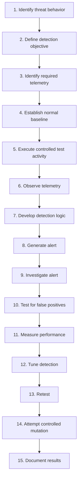

# SENTINEL Detection Engineering

> Does your detection still work when the attacker changes tactics?

This document defines how SENTINEL designs, implements, tests, tunes, measures, and improves security detections. It is a methodology and working specification, not a record of completed work — no detection described here has been validated yet, and no attack has been executed for detection-validation purposes. Where implementation status matters, it is marked explicitly as **CURRENT FOUNDATION**, **PLANNED**, **TESTED**, **VALIDATED**, or **FUTURE**.

SENTINEL does not treat a detection as successful merely because a rule exists. The validation model is:

```
Threat → Attack Scenario → Telemetry → Detection Logic → Alert →
Investigation → Validation → Measurement → Tuning → Retest
```

A detection is only considered validated once it has been tested against real controlled activity in the lab and the result has been documented.

---

## 1. Purpose

This document exists to define how SENTINEL develops detections that are:

- Observable — grounded in telemetry that actually exists
- Relevant — tied to a real threat, not written for its own sake
- Testable — validated against a controlled scenario, not assumed
- Explainable — an analyst can state why the detection fired
- Measurable — performance is recorded, not claimed
- Maintainable — documented well enough to update later
- Resistant to reasonable attacker variation — the eventual goal, not a guarantee

This is a methodology for building toward reliable detections; it does not claim any detection here is perfect or complete.

---

## 2. Detection Engineering Lifecycle



**Status: PLANNED.** This lifecycle is the intended process for v0.2 onward — it has not yet been run end to end for any detection.

---

## 3. Detection Design Requirements

Every detection should have a documented specification **before** implementation:

| Field | Description |
|---|---|
| Detection ID | Unique project identifier |
| Name | Human-readable detection name |
| Objective | What behavior should be detected |
| Threat | Threat being addressed (see `threat-modeling.md`) |
| Asset | Target system |
| MITRE ATT&CK | Technique/sub-technique where applicable |
| Telemetry Source | Required log/event source |
| Detection Logic | Conditions that should trigger the alert |
| Expected Context | What surrounding information matters for triage |
| Severity | Intended severity classification |
| False Positive Sources | Known legitimate behaviors that could trigger it |
| Test Scenario | Controlled scenario used for validation |
| Evidence | Supporting artifacts (screenshots, logs, alert output) |
| Status | Draft / Tested / Validated / Retired |

No detection ID, MITRE technique, or Wazuh rule ID is assigned in this document — those are created when a specific detection is actually designed.

---

## 4. Telemetry-First Engineering

SENTINEL begins with telemetry, not with rules:

```
Behavior
  ↓
What evidence should exist?
  ↓
Which telemetry source contains it?
  ↓
Is the telemetry available?
  ↓
Is it reliable enough?
  ↓
Can the behavior be distinguished from normal activity?
  ↓
Design detection
```

A detection cannot compensate for telemetry that is missing, incomplete, or unreliable — if the underlying evidence isn't captured, no amount of rule-writing will make the detection trustworthy.

---

## 5. Baseline Before Detection

Understanding normal activity before tuning a detection reduces false positives and clarifies what "suspicious" actually means for this lab. Baseline areas of interest include:

- Normal authentication activity
- Normal process activity
- Normal file changes
- Normal system behavior
- Normal administrative activity

**Status: PLANNED.** No baseline observations have been recorded yet. Actual baseline data will be gathered and documented during v0.2, once Linux telemetry configuration is underway.

---

## 6. Current Linux Telemetry Plan

The current target endpoint is **SENTINEL-LINUX01** (`10.10.10.40`). Planned telemetry areas:

### Authentication
- Successful authentication
- Failed authentication
- Repeated attempts
- Account activity

### Process / Command Activity
- Process execution
- Suspicious command patterns
- Execution context where available

### File / System Changes
- Important file modifications
- Configuration changes
- Integrity monitoring where appropriate

### Network Activity
- Relevant connection activity
- Service exposure
- Suspicious connection patterns where observable

### Privilege / Identity Activity
- Privilege-related events
- Account changes
- Suspicious administrative behavior

**These are telemetry goals, not current configuration.** None of the above sources are fully configured on SENTINEL-LINUX01 today; the Wazuh Agent (version 4.14.8, ID `001`, status Active) is connected and reporting, but detailed telemetry engineering has not been completed.

---

## 7. Detection Types

### Signature / Rule-Based
Detects known patterns or fixed conditions.

### Threshold / Frequency-Based
Detects repeated behavior over a defined time window.

### Correlation
Combines multiple events into a stronger, more reliable signal.

### Behavioral
Detects suspicious behavior patterns rather than one fixed string or event.

### Sequence-Based
Detects a meaningful chain of related events.

SENTINEL prefers the simplest detection type that reliably captures the intended behavior — complexity is added only when a specific detection gap requires it, not by default.

---

## 8. Detection Quality

### True Positive
Malicious activity correctly detected.

### False Positive
Legitimate activity incorrectly detected as malicious.

### False Negative
Relevant malicious activity that the detection missed.

### True Negative
Normal activity correctly left unalerted.

SENTINEL cares about both sides of this equation: catching malicious behavior and avoiding unnecessary alert noise. Neither goal is prioritized to the point of ignoring the other.

---

## 9. Detection Testing

Every detection should eventually go through a controlled test:

1. Prepare the target.
2. Establish a baseline.
3. Execute authorized test activity from SENTINEL-KALI.
4. Capture relevant telemetry.
5. Determine whether the detection fired.
6. Record the alert timestamp.
7. Investigate the alert.
8. Record evidence.
9. Check for false positives.
10. Repeat if necessary.
11. Modify the detection.
12. Retest.

No destructive attack instructions are included here or anywhere in SENTINEL's documentation; testing is scoped to safe, reversible activity inside the isolated lab.

---

## 10. Detection Status Model

```
DRAFT
  ↓
TELEMETRY VERIFIED
  ↓
TESTED
  ↓
TUNED
  ↓
VALIDATED
  ↓
MONITORED
  ↓
RETESTED
```

Also possible at any stage: **FAILED** (the test scenario did not produce the expected result and requires investigation) and **RETIRED** (the detection is no longer relevant or has been superseded).

| Status | Meaning |
|---|---|
| Draft | Specification written, not yet implemented |
| Telemetry Verified | Required telemetry confirmed available and reliable |
| Tested | A controlled scenario has been run against it at least once |
| Tuned | Logic adjusted based on test results |
| Validated | Meets the validation criteria in Section 11 |
| Monitored | Running in the lab under ongoing observation |
| Retested | Re-run after tuning or after a mutation attempt |
| Failed | Did not detect as expected; under investigation |
| Retired | No longer maintained or relevant |

**A detection is not "Validated" simply because it was written.** No detection currently exists past the Draft stage.

---

## 11. Detection Validation Criteria

A detection is considered validated only when **all** of the following are true:

- Required telemetry is available and confirmed reliable.
- The intended test scenario was actually executed.
- The expected behavior was observed in telemetry.
- The detection fired correctly in response.
- The resulting alert contains useful triage context.
- False-positive behavior was examined, not assumed absent.
- Supporting evidence was captured.
- Results were documented.
- The detection was retested after any tuning.

No arbitrary pass percentage is defined at this stage; a project-specific numeric threshold (if any) will be introduced later if it proves useful, not invented here.

---

## 12. Detection Metrics

Future metrics (primarily v0.5) may include:

- Attack executions
- Successful detections
- Missed detections
- False positives
- Detection rate
- Detection time
- Response time
- Before/after tuning performance

Definition:

```
Detection Rate = Successful Detections / Attack Executions
```

No values are calculated here — there is no test data yet. From v0.2 onward, individual detection tests should capture the underlying evidence (timestamps, outcomes, telemetry) needed to compute these metrics later, even though aggregate metrics themselves belong to v0.5.

---

## 13. False Positive Engineering

False positives are treated as engineering evidence, not noise to suppress blindly. For every meaningful false positive, record:

- What triggered it?
- What legitimate activity caused it?
- Why did the detection interpret it as suspicious?
- How can the detection be improved?
- What legitimate behavior must remain detectable after the fix?
- Did the tuning introduce a new false negative?

The goal is improved precision without silently losing coverage of real malicious behavior.

---

## 14. False Negative Engineering

Missed detections are especially valuable in SENTINEL, since they directly inform the project's resilience goals. For every meaningful missed detection, record:

- What happened?
- What telemetry existed at the time?
- Why did the detection miss it?
- Was the telemetry incomplete?
- Was the detection logic too narrow?
- Did the attacker's behavior change from what the detection expected?
- Did attacker variation defeat the detection?
- What modification could improve coverage?
- Can the original scenario be retested after the fix?

This analysis feeds directly into the mutation/resilience work in Section 15.

---

## 15. Attack Mutation

**Status: FUTURE — planned for v0.6.**

```
Original behavior
  ↓
Detection
  ↓
Change attacker execution method
  ↓
Retest
  ↓
Detection result
  ↓
Analyze resilience
```

Possible mutation dimensions: tool variation, command variation, encoding, execution method, timing, and sequence variation. The objective is to preserve the attacker's underlying goal while changing execution details, to see whether the detection generalizes or was overfit to one specific implementation.

No mutation testing currently exists in SENTINEL.

---

## 16. Attack DNA

**Status: FUTURE — planned for v0.6.**

A complete attack can be represented as a chain of behaviors rather than a single isolated alert. Example conceptual chain:

```
Execution
  ↓
Discovery
  ↓
Credential Activity
  ↓
Privilege Activity
  ↓
Persistence
  ↓
Lateral Movement
  ↓
Impact
```

Not every scenario will necessarily include every stage of this chain. This concept has not been implemented yet.

---

## 17. Detection Coverage Matrix

| Scenario | Behavior | MITRE Technique | Telemetry | Detection | Status | Test Result |
|---|---|---|---|---|---|---|
| *(none defined yet)* | — | — | — | — | Not Tested | — |

This matrix is a template and will grow as scenarios are designed and tested during v0.2 and beyond. No technique or result is invented in advance of actual testing.

---

## 18. Detection Failure Loop

```
Detection
   ↓
  Test
   ↓
 FAIL?
 ├── NO  → Measure → Document
 └── YES → Investigate Failure
              ↓
       Improve Telemetry/Logic
              ↓
            Retest
```

Failure is an expected and normal part of detection engineering. A missed detection is treated as a learning opportunity to document, not something to hide or omit from the record.

---

## 19. Detection Documentation

Every completed detection should eventually have:

- Detection specification (Section 3 template)
- Telemetry source
- Detection logic
- MITRE ATT&CK mapping
- Test scenario used
- Alert evidence
- Investigation notes
- False-positive analysis
- Validation result
- Tuning history
- Retest result

None of these artifacts exist yet for any detection — this is the documentation standard detections will be held to once they are built.

---

## 20. GitHub / Repository Practices

Detection-engineering artifacts may eventually be stored under:

```
detections/
tests/
evidence/
metrics/
```

The repository must **not** contain: credentials, API keys, tokens, private keys, secrets, VM disks, sensitive raw telemetry, or personal information. Detection rules and configurations should be documented with enough context (objective, telemetry source, reasoning) that someone else could understand why the detection exists, not just what it matches.

---

## 21. Current v0.1 Status

### Completed
- [x] Wazuh infrastructure deployed
- [x] Linux01 deployed
- [x] Wazuh Agent installed
- [x] Agent registered
- [x] Agent Active
- [x] Agent/Wazuh connectivity verified

### Not Yet Implemented
- [ ] Detailed Linux telemetry engineering
- [ ] First detection specification
- [ ] First controlled detection scenario
- [ ] Detection rule validation
- [ ] False-positive analysis
- [ ] Detection metrics
- [ ] Attack mutation

### Next Phase
**v0.2 — Detection Engineering & Linux Telemetry**

---

## 22. Maintenance

This document should be updated when:

- A new detection methodology is adopted.
- A new telemetry source becomes available.
- A new detection type is introduced.
- A new validation requirement is defined.
- A new metric is introduced.
- A new attack-mutation strategy is developed.
- A significant detection-engineering lesson changes the approach described here.

Individual detection results belong in their own detection specifications and test records — this document defines the methodology and should not be rewritten every time a single detection is built or tested.
