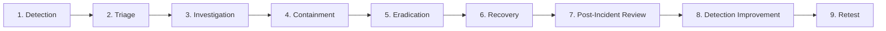
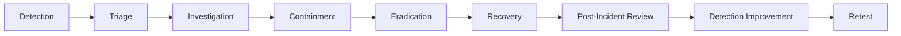
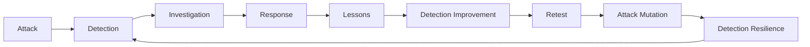

# SENTINEL Incident Response

> Does your detection still work when the attacker changes tactics?

This document defines SENTINEL's incident-response methodology: how a detected security event is intended to move from initial detection through investigation, response, recovery, and — critically — back into detection improvement. SENTINEL is not meant to simulate only the alerting stage; the goal is to practice the full SOC workflow end to end, and to do so in a way that is **evidence-driven** at every step.

```
Detection → Triage → Investigation → Containment → Eradication →
Recovery → Post-Incident Review → Detection Improvement → Retest
```

**This is a methodology document.** No incident described in this document has occurred yet — sections below are written as the process SENTINEL will follow, clearly marked where they describe current, in-progress, planned, or future capability.

---

## 1. Purpose

This document establishes how SENTINEL responds to a detected event, so that response work is consistent, repeatable, and produces evidence rather than assumptions. Incident response here is not a checklist to satisfy — it is meant to feed directly back into detection engineering: every incident should eventually produce a lesson that improves a detection, and that improvement should be retested.

---

## 2. Current v0.1 State

### SENTINEL-WAZUH
| Field | Value |
|---|---|
| Role | SOC / monitoring / detection platform |
| IP | 10.10.10.10 |
| OS | Ubuntu 24.04 |
| Wazuh | 4.14.8, all-in-one, Dashboard operational |

### SENTINEL-KALI
| Field | Value |
|---|---|
| Role | Controlled attacker / adversary-emulation system |
| IP | 10.10.10.20 |

### SENTINEL-LINUX01
| Field | Value |
|---|---|
| Role | Monitored Linux endpoint / target |
| IP | 10.10.10.40 |
| OS | Ubuntu 24.04.5 LTS |
| Wazuh Agent | 4.14.8, Agent ID `001`, agent name `sentinel-linux01` |
| Agent status | Active, enabled at boot |

**Network:** `SENTINEL-LAB` — `10.10.10.0/24`, an internal isolated laboratory network. NAT provides Internet access separately and is not part of the lab's internal attack surface. The lab is intended strictly for authorized, controlled testing.

**Current state, plainly stated:** v0.1 is infrastructure foundation and SOC/agent connectivity. **No attack scenario has been executed, and no incident-response case has been validated.** Everything described from Section 3 onward is the methodology SENTINEL intends to follow once real scenarios exist.

---

## 3. Incident Response Philosophy

1. Preserve evidence before changing the system, where practical.
2. Do not immediately destroy attacker activity before collecting useful evidence.
3. Separate facts from assumptions.
4. Record timestamps for every meaningful action and observation.
5. Record commands and actions taken by the analyst.
6. Maintain a clear incident timeline.
7. Identify affected assets explicitly.
8. Track indicators of compromise (IOCs).
9. Map relevant behavior to MITRE ATT&CK when the mapping is confidently applicable.
10. Document uncertainty rather than papering over it.
11. Avoid claiming conclusions that the evidence does not support.
12. Every significant incident should produce lessons that improve detection.

**Terminology matters:**

| Term | Meaning |
|---|---|
| Event | A single recorded occurrence (a log line, a process execution) |
| Alert | A detection rule fired in response to one or more events |
| Security incident | An alert (or set of alerts) that has been triaged as warranting investigation |
| Confirmed compromise | An incident where investigation has established that unauthorized access or control actually occurred |

A Wazuh alert is **not** automatically a confirmed compromise — it is the starting point for triage, nothing more.

---

## 4. Incident Lifecycle



**Status: PLANNED.** No incident has moved through this full lifecycle yet. Each phase below describes its objective, expected analyst actions, evidence to collect, key decision points, and expected output — as intended process, not completed work.

---

## 5. Phase 1 — Detection

An incident may begin from:

- A Wazuh alert
- An authentication anomaly
- A suspicious process
- Suspicious command execution
- A file/system modification
- Network activity
- Correlated events
- Analyst-initiated threat hunting

**Current state:** telemetry and detection engineering are still being developed (see `detection-engineering.md`). No detection rule or alert is described here as existing, because none has been built and validated yet. Once detections exist, they should provide enough triage context (asset, user, process, timestamp) to move directly into Phase 2.

---

## 6. Phase 2 — Triage

Triage determines:

- What happened?
- Which asset is involved?
- When did it happen?
- Is the activity expected?
- Is it suspicious?
- Is it potentially malicious?
- What evidence is available?
- Does this warrant escalation to a full investigation?

### Triage checklist template

| Field | Value |
|---|---|
| Alert ID | *(to be filled per real alert)* |
| Timestamp | |
| Affected asset | |
| Source | |
| Destination (if applicable) | |
| User / account | |
| Process | |
| Command line | |
| File / path | |
| Network information | |
| Related alerts | |
| Initial severity | |
| Analyst confidence | |
| Initial hypothesis | |

This is a blank template — no fabricated values are included, since no real alert exists to populate it yet.

---

## 7. Phase 3 — Investigation

### Potential evidence sources
- Linux authentication logs
- Process execution telemetry
- Command history, where available
- File/system changes
- Network connections
- Wazuh telemetry and alerts
- System configuration
- Relevant timestamps
- Other future telemetry sources as the lab expands

### Investigation activities
- Timeline construction
- IOC identification
- Attack-path reconstruction
- Parent/child process relationship analysis, where telemetry supports it
- User/account activity review
- Persistence investigation
- Privilege-escalation investigation
- Defense-evasion investigation
- Lateral-movement investigation, when applicable

What evidence is actually available for any of the above depends entirely on which telemetry sources are configured at the time — investigation cannot exceed what the telemetry pipeline actually captured.

---

## 8. Evidence Handling

Evidence should be:

- Timestamped
- Traceable to its source
- Relevant to the incident
- Preserved rather than overwritten
- Stored separately from raw system state where appropriate
- Documented with source and context

### Evidence structure

```
evidence/
├── v0.1/
├── v0.2/
├── v0.3/
├── v0.4/
├── v0.5/
└── v0.6/
```

Evidence may eventually include screenshots, Wazuh alerts, detection-test output, relevant logs, investigation notes, timelines, metrics, and case artifacts. Sensitive telemetry, credentials, secrets, VM disks, and large raw datasets are never committed to GitHub.

---

## 9. Incident Timeline

Standard timeline format:

| Time | Asset | Event | Evidence | Analyst Interpretation |
|---|---|---|---|---|
| *(no incidents recorded yet)* | | | | |

Timestamps should use a consistent timezone throughout a case, while original source timestamps are retained where they differ, so the raw evidence isn't altered.

---

## 10. Incident Severity

Future severity scale:

```
Informational → Low → Medium → High → Critical
```

Severity should eventually consider: asset importance, type of activity, scope, privilege level involved, persistence, credential exposure, data impact, detection confidence, and impact within the simulated environment. **No finalized scoring formula exists yet**, and no severity has been assigned to any incident, since none has occurred.

---

## 11. Containment

Containment options appropriate for this lab:

- Isolate an endpoint from the lab network
- Stop a malicious process
- Disable a compromised test account
- Block an identified malicious connection
- Stop a controlled attack in progress
- Preserve evidence before destructive containment, where practical

| Type | Description |
|---|---|
| Short-term containment | Immediate action to stop active harm (e.g., isolate the endpoint) |
| Long-term containment | Durable fix while investigation continues (e.g., disable the account, monitor closely) |

No automated response currently exists. Any future response automation must include human review where appropriate — see Section 21.

---

## 12. Eradication

Eradication means removing the actual cause of a compromise. Potential actions:

- Remove persistence mechanisms
- Remove malicious files
- Revoke/reset test credentials
- Remove unauthorized accounts
- Restore modified configurations
- Remove attacker tooling
- Correct vulnerable configurations that enabled the compromise

Because SENTINEL runs in VirtualBox, reverting to a clean VM snapshot may sometimes be an appropriate eradication step **after** evidence has been collected. This workflow has not been implemented or exercised yet.

---

## 13. Recovery

Recovery includes:

- Restoring normal operation
- Verifying endpoint health
- Verifying Wazuh Agent connectivity
- Confirming expected telemetry is flowing again
- Verifying security controls are intact
- Monitoring for recurrence of the same behavior
- Re-running relevant detection tests

Recovery is not complete just because a system boots again — it requires confirming that monitoring and detection are actually working as expected post-incident.

---

## 14. Post-Incident Review

Every significant SENTINEL case should answer:

- What happened?
- Why did it happen?
- How was it detected?
- What evidence confirmed it?
- What was missed?
- What worked?
- What failed?
- What caused false positives or false negatives?
- How long did detection take?
- How long did response take?
- What should change?
- How will the change be validated?

Core principle:

```
Incident → Lesson → Detection Improvement → Retest
```

---

## 15. Case Report Format

```markdown
# Case-XXX

## Incident Summary
## Severity
## Affected Assets
## Initial Detection
## Timeline
## Evidence
## Indicators of Compromise
## MITRE ATT&CK Mapping
## Investigation
## Root Cause
## Containment
## Eradication
## Recovery
## Detection Performance
## Failure / False Positive Analysis
## Improvements
## Retest Results
## Lessons Learned
```

**No Case-001 exists.** A case report will be created only after the first controlled incident has actually been executed and investigated.

---

## 16. MITRE ATT&CK in Incident Response

MITRE ATT&CK is used to describe observed adversary behavior with a standard vocabulary — not to decorate a report with technique IDs that weren't actually confirmed.

```
Observed behavior → Identify technique → Validate evidence →
Map to MITRE ATT&CK → Document confidence → Identify detection coverage → Identify gaps
```

No ATT&CK mapping is included in this document, since no attack has occurred to map.

---

## 17. IOC Handling

Possible IOC categories: IP addresses, domains, URLs, file hashes, file paths, filenames, usernames, processes, command lines, registry/configuration artifacts where applicable, and network connections.

Every IOC should include context — where it was observed, when, and why it's considered relevant — rather than being listed bare. No IOCs are fabricated or listed here, since none have been observed yet.

---

## 18. Threat Hunting Connection

Incident investigation asks: *"What happened in this incident?"*

Threat hunting asks a broader question: *"Could the same behavior have happened elsewhere, or gone undetected?"*

Findings from incident response are intended to seed future threat-hunting hypotheses once that capability exists.

---

## 19. Purple-Team Connection

**Status: FUTURE.**

```
Attack → Detection → Investigation → Response →
Identify weakness → Improve detection/control → Retest attack
```

This feedback loop is one of SENTINEL's main differentiators, but it has not been validated yet — no detection has gone through this full loop.

---

## 20. Attack DNA Connection

**Status: FUTURE — planned for v0.6.**

Attack DNA represents the behavioral structure of a controlled attack as a chain, using only the stages actually relevant to a given scenario:

```
Initial Access → Execution → Discovery → Privilege Escalation →
Persistence → Defense Evasion → Credential Access → Collection →
Exfiltration → Impact
```

This will eventually let SENTINEL compare an original attack against a mutated version of it, asking whether the same detection still fires. No such comparison has been performed.

---

## 21. Response Automation

**Status: FUTURE.**

Possible future automated actions: disable an account, isolate an endpoint, block an indicator, kill a process, collect evidence, create an incident record, notify an analyst.

Any future automation must remain controlled:

```
Trigger → Validation → Analyst decision where appropriate →
Action → Verification → Audit trail
```

No automated response exists in SENTINEL today.

---

## 22. Response Safety

- Only act against authorized lab assets.
- Never target external systems.
- Do not use real credentials.
- Do not use real sensitive information.
- Do not allow uncontrolled propagation of any test activity.
- Preserve evidence before destructive actions, where practical.
- Keep all response experiments inside SENTINEL-LAB.
- Avoid accidental impact to the host system.

---

## 23. Failure-Driven Response Engineering

Failures are valuable and should be documented, not hidden. Examples of the kind of failure worth recording:

- A detection fired but lacked useful context.
- Investigation could not determine the responsible process.
- The timeline had missing timestamps.
- Containment happened before evidence was collected.
- A response action caused an unintended side effect.
- Telemetry unexpectedly stopped flowing.
- A detection worked for one attack variant but failed for a mutated one.

These belong in:

```
failure-log/detection-failures.md
failure-log/false-positives.md
failure-log/mutation-failures.md
failure-log/infrastructure-issues.md
```

No entries currently exist in these logs — they will be populated as real failures occur.

---

## 24. Response Metrics

**Status: FUTURE.** Potential metrics, with no values calculated yet:

| Metric | Purpose |
|---|---|
| Time to Detect (TTD) | How long between attack execution and alert |
| Time to Triage | How long between alert and triage decision |
| Time to Investigate | How long the investigation phase takes |
| Time to Contain | How long between confirmation and containment |
| Time to Recover | How long until normal operation is restored |
| Time to Respond (TTR) | End-to-end detection-to-response time |
| Detection success | Whether the detection fired as intended |
| False positives | Legitimate activity incorrectly flagged |
| False negatives | Malicious activity missed |
| Evidence completeness | Whether sufficient evidence was captured |
| Response success | Whether the response achieved its goal |
| Retest success | Whether a fix held up on retest |

No graphs are produced until real measurements exist to chart.

---

## 25. Current vs Planned Capabilities

| Capability | Current State | Planned Version |
|---|---|---|
| Wazuh monitoring | Operational | v0.1 (done) |
| Linux agent telemetry | Agent connected; detailed telemetry not yet configured | v0.2 |
| Detection engineering | Not started | v0.2 |
| Alert triage | Template defined, not yet exercised | v0.2 / v0.3 |
| Investigation | Methodology defined, not yet exercised | v0.3 |
| Case reports | Format defined, no cases yet | v0.3 |
| Incident response | Methodology defined (this document), not yet exercised | v0.4 |
| Threat hunting | Not started | v0.3 |
| Response automation | Not implemented | Future |
| Metrics | Not collected | v0.5 |
| Purple-team validation | Not implemented | v0.5 |
| Attack DNA | Not implemented | v0.6 |
| Attack mutation | Not implemented | v0.6 |
| Detection resilience testing | Not implemented | v0.6 |
| Windows/AD expansion | Not implemented | Future |
| Custom SENTINEL console | Not implemented | Future |

Roadmap reference: v0.1 infrastructure foundation → v0.2 detection engineering & Linux telemetry → v0.3 SOC investigation → v0.4 incident response → v0.5 purple-team measurement → v0.6 attack DNA & mutation.

---

## 26. Relationship with Other SENTINEL Documents

| Document | Role |
|---|---|
| `Project Overview.md` | Overall project direction and concept |
| `Requirements.md` | Infrastructure and environment requirements |
| `architecture.md` | Documents the actual implementation |
| `threat-modeling.md` | Identifies the threats this document responds to |
| `detection-engineering.md` | Defines the detection strategy that feeds alerts into this process |
| `test-and-matrices.md` | Validates whether controls actually work |
| `lessons-and-failures.md` | Records weaknesses surfaced during response |
| `incident-response.md` (this document) | Defines investigation and response methodology |

Conceptually: the threat model identifies threats → detection engineering builds detections for them → incident response investigates and responds when they fire → testing validates the result → lessons and failures record what didn't work → the project overview and architecture documents tie it all together.

---

## 27. Documentation Rules

Incident reports must be factual. Use explicit labels where useful:

```
FACT | OBSERVATION | HYPOTHESIS | CONFIRMED | UNKNOWN
```

Assumptions are never written as conclusions. Failed tests are never hidden, and failed detection results are never deleted just because a later version worked — the failure is part of the record.

---

## 28. Diagrams

### Incident Response Lifecycle



### SENTINEL Feedback Loop



---

## 29. Final Status

**Current:**
- v0.1 infrastructure foundation established
- Wazuh operational
- Kali operational
- Linux01 operational
- Wazuh Agent connected
- Lab networking established

**In progress:**
- Linux telemetry validation
- Detection engineering preparation

**Not yet completed:**
- First controlled attack scenario
- Validated detection
- Incident investigation
- Incident response case
- Response metrics
- Purple-team validation
- Attack mutation

**Future:**
- Windows/AD expansion
- Custom SENTINEL console
- Advanced automation, deception, or DFIR tooling, where justified

This document describes the methodology SENTINEL will use, while honestly reflecting what SENTINEL can actually do today.
