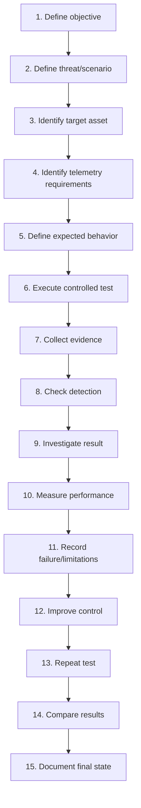

# SENTINEL Testing & Validation Matrices

> Does your detection still work when the attacker changes tactics?

This is a core engineering document. It defines **how** SENTINEL proves that its detections, investigations, responses, and defensive controls actually work — not just that they exist. The v0.1 infrastructure is deployed, but meaningful detection validation has **not** yet been completed; this document is the methodology that later phases will be measured against, with clearly labeled status throughout: **CURRENT / IMPLEMENTED**, **IN PROGRESS**, **PLANNED**, or **FUTURE**.

---

## 1. Purpose

The central question this document answers is:

> **How do we prove that SENTINEL's security controls actually work?**

SENTINEL does not rely on:

- Screenshots alone
- A single successful alert
- Tool dashboards alone
- Assumptions
- Vendor claims
- The existence of a detection rule
- A detection rule firing once

Instead, SENTINEL uses controlled, repeatable experiments:

```
ATTACK → OBSERVE → DETECT → INVESTIGATE → RESPOND → MEASURE → IMPROVE → RETEST
```

And later:

```
ATTACK MUTATION → RETEST → MEASURE DETECTION RESILIENCE
```

This document provides the framework for that process.

---

## 2. Why Testing Is Critical to SENTINEL

A security control can exist without being effective. For example:

- A Wazuh rule may exist but never trigger.
- An alert may trigger but contain insufficient context.
- A detection may work for one attack variation but fail for another.
- A detection may generate too many false positives to be useful.
- An investigation may not have enough telemetry to reach a conclusion.
- A response action may work but create unintended consequences.
- A detection may work today and silently break after a configuration change.

**"Configured" does not mean "validated."**

```
Configuration → Implementation → Testing → Validation → Measurement → Continuous Retesting
```

---

## 3. Current v0.1 State

### SENTINEL-WAZUH
| Field | Value |
|---|---|
| Role | SOC / monitoring / detection platform |
| IP | 10.10.10.10 |
| OS | Ubuntu 24.04 |
| Wazuh | 4.14.8, Dashboard operational |

### SENTINEL-KALI
| Field | Value |
|---|---|
| Role | Controlled attacker / adversary-emulation system |
| IP | 10.10.10.20 |

### SENTINEL-LINUX01
| Field | Value |
|---|---|
| Role | Monitored Linux endpoint |
| IP | 10.10.10.40 |
| OS | Ubuntu 24.04.5 LTS |
| Wazuh Agent | 4.14.8, Agent ID `001`, agent name `sentinel-linux01`, status Active, enabled at boot |

**Network:** `SENTINEL-LAB` — `10.10.10.0/24`, internal laboratory network.

**Current state:** infrastructure established, Wazuh operational, Kali operational, Linux01 operational, Wazuh Agent connected, lab connectivity verified.

**Not yet completed:** first controlled attack test, validated detection, detection performance measurement, full investigation test, full response test, purple-team measurement, attack mutation testing. None of these are described elsewhere in this document as having already occurred.

---

## 4. Testing Philosophy

### Repeatability
A test should be reproducible. Another person should be able to understand what was tested, against which asset, under what conditions, what action was performed, what telemetry was expected, what detection was expected, and what result occurred.

### Controlled Execution
Tests occur only inside the authorized SENTINEL laboratory.

### Evidence-Based Validation
Every meaningful test produces evidence — not just a claim of success.

### Isolation
Tests remain inside the lab at all times.

### Small Experiments
Focused, narrow tests are preferred before attempting large attack chains.

### Failure Is Data
A failed detection is not something to hide — it is evidence that the control needs improvement.

### Retesting
After a detection is modified, the same test is repeated to confirm the fix actually held.

---

## 5. Test Lifecycle



---

## 6. Test Types

### 6.1 Connectivity Tests
Verify VM connectivity, Wazuh Agent connectivity, network segmentation, expected routing, and required ports/services. These are foundational tests — the ones v0.1 has actually exercised so far.

### 6.2 Telemetry Tests
Verify that expected activity generates usable telemetry: authentication activity, process execution, command execution, file modification, network activity, privilege-related activity. No specific telemetry source is claimed as configured here unless confirmed in `detection-engineering.md`.

### 6.3 Detection Tests
Verify whether a detection identifies expected malicious/suspicious behavior.

### 6.4 Investigation Tests
Verify whether available telemetry allows an analyst to reconstruct what happened.

### 6.5 Response Tests
Verify controlled response procedures.

### 6.6 Regression Tests
Verify that previously working detections continue to work after changes.

### 6.7 Adversary-Emulation Tests
Use controlled attack techniques to simulate realistic attacker behavior.

### 6.8 Mutation Tests (Future — v0.6)
Modify the attack implementation while preserving the underlying objective:

```
Original:  Technique → Behavior A → Detection
Mutation:  Same objective → Behavior B → Detection test
```

Measure whether the detection remains effective across the variation.

---

## 7. Test Case Structure

Every test should record:

| Field | Description |
|---|---|
| Test ID | Unique test identifier |
| Test Name | Human-readable name |
| Version | Project version this test belongs to |
| Objective | What the test proves |
| Threat | Threat being tested (from `threat-modeling.md`) |
| Target Asset | System being tested |
| Source Asset | System generating the activity |
| Prerequisites | What must be true before the test runs |
| Attack/Activity | What is actually executed |
| Expected Telemetry | What should be logged |
| Expected Detection | What should trigger |
| Expected Investigation Evidence | What an analyst should be able to reconstruct |
| Expected Response | What response action, if any, should occur |
| MITRE ATT&CK Mapping | Technique, if confidently applicable |
| Success Criteria | Conditions for success |
| Evidence Location | Where proof of the result is stored |
| Actual Result | What actually happened |
| Status | PASS / FAIL / PARTIAL / BLOCKED |
| Failure Notes | What went wrong, if anything |
| Improvements | Changes made as a result |
| Retest ID | Link to the retest, if one occurred |

No completed test cases are populated in this document — this is the template, not a log of results.

---

## 8. Test Status Model

```
DRAFT → READY → EXECUTED → PASSED → FAILED → PARTIAL → BLOCKED → RETESTED → VALIDATED
```

| Status | Meaning |
|---|---|
| Draft | Test case written, not yet ready to run |
| Ready | Prerequisites confirmed, ready to execute |
| Executed | Test has been run at least once |
| Passed | Success criteria met on that run |
| Failed | Success criteria not met |
| Partial | Some but not all success criteria met |
| Blocked | Could not be executed due to missing prerequisites |
| Retested | Re-run after a change, to confirm the result holds |
| Validated | Meets the full validation criteria defined for that test type |

**Passed does not mean production-quality**, and a single pass does not equal Validated — Validated is reserved for tests that have met their defined validation criteria, including retesting where required.

---

## 9. Success Criteria

Every test must define success **before** execution. Examples by test type:

- **Telemetry test:** expected telemetry is generated and received by Wazuh.
- **Detection test:** expected malicious behavior generates the intended detection.
- **Investigation test:** the analyst can reconstruct the required sequence of events from available evidence.
- **Response test:** the defined response action executes successfully and is verified.
- **Regression test:** a previously validated detection continues to behave as expected after a change.
- **Mutation test:** the detection continues to identify a meaningful proportion of relevant behavior after controlled variation.

No arbitrary percentages are defined here — any numeric threshold will only be introduced once the project has real data to justify one.

---

## 10. Pass / Fail / Partial Definitions

| Result | Meaning |
|---|---|
| PASS | All required success criteria satisfied |
| FAIL | One or more critical success criteria not satisfied |
| PARTIAL | Some objectives succeeded, but important coverage/context was missing |
| BLOCKED | Test could not be executed because prerequisites were unavailable |
| NOT TESTED | No execution has occurred yet |
| NOT APPLICABLE | The test does not apply to the current scenario |

---

## 11. Test Matrix

Master template — no fictional results are included:

| Test ID | Version | Threat | Technique | MITRE ATT&CK | Source | Target | Telemetry | Detection | Investigation | Response | Expected Result | Actual Result | Status | Evidence | Retest Required |
|---|---|---|---|---|---|---|---|---|---|---|---|---|---|---|---|
| *(none recorded yet)* | | | | | | | | | | | | | NOT TESTED | | |

This matrix becomes increasingly populated from v0.2 onward as real tests are designed and executed.

---

## 12. Detection Coverage Matrix

| Threat | Technique | Technique ID | Attack Scenario | Telemetry Source | Detection | Investigation Support | Response Support | Current Status | Known Gaps | Last Tested | Retest Required |
|---|---|---|---|---|---|---|---|---|---|---|---|
| *(none recorded yet)* | | | | | | | | Not Tested | | — | — |

**Important:** a threat or technique appearing in this matrix does not mean it is detected. Coverage is only marked after actual testing has occurred.

---

## 13. Telemetry Coverage Matrix

| Telemetry Category | Source | Expected Event | Collection Method | Available? | Verified? | Detection Dependency | Investigation Dependency | Known Limitations |
|---|---|---|---|---|---|---|---|---|
| Authentication | SENTINEL-LINUX01 | Login success/failure | Wazuh Agent | TBD | No | — | — | — |
| Process Execution | SENTINEL-LINUX01 | Process start events | Wazuh Agent | TBD | No | — | — | — |
| Command Execution | SENTINEL-LINUX01 | Command context | Wazuh Agent | TBD | No | — | — | — |
| File/System Changes | SENTINEL-LINUX01 | File integrity events | Wazuh Agent (FIM) | TBD | No | — | — | — |
| Network Activity | SENTINEL-LINUX01 | Connection events | Wazuh Agent | TBD | No | — | — | — |
| Privilege/Identity | SENTINEL-LINUX01 | Privilege change events | Wazuh Agent | TBD | No | — | — | — |
| Persistence | SENTINEL-LINUX01 | Persistence-related changes | Wazuh Agent | TBD | No | — | — | — |
| Configuration Changes | SENTINEL-LINUX01 | Config file changes | Wazuh Agent (FIM) | TBD | No | — | — | — |

Rows are marked "Verified" only after that specific telemetry source has actually been tested end to end.

---

## 14. Investigation Coverage Matrix

| Investigation Question | Required Evidence | Telemetry Source | Available? | Verified? | Confidence | Known Gap |
|---|---|---|---|---|---|---|
| Who performed the action? | User/account context | TBD | TBD | No | — | — |
| When did it happen? | Timestamp | TBD | TBD | No | — | — |
| What process executed? | Process telemetry | TBD | TBD | No | — | — |
| What command was executed? | Command context | TBD | TBD | No | — | — |
| What file changed? | FIM data | TBD | TBD | No | — | — |
| What account was involved? | Auth/account logs | TBD | TBD | No | — | — |
| What network connection occurred? | Network telemetry | TBD | TBD | No | — | — |
| What happened immediately before? | Timeline context | TBD | TBD | No | — | — |
| What happened immediately after? | Timeline context | TBD | TBD | No | — | — |
| Was persistence established? | Persistence telemetry | TBD | TBD | No | — | — |
| Was privilege escalation attempted? | Privilege telemetry | TBD | TBD | No | — | — |

---

## 15. Response Test Matrix

| Response ID | Trigger | Incident Type | Response Action | Preconditions | Expected Outcome | Verification | Evidence | Rollback | Status |
|---|---|---|---|---|---|---|---|---|---|
| *(none recorded yet)* | | | | | | | | | NOT TESTED |

Examples of future controlled response actions: isolate endpoint, stop malicious process, disable test account, remove test persistence, block test indicator, restore modified configuration, rebuild/revert lab endpoint. No response automation currently exists.

---

## 16. Regression Testing

A detection that worked yesterday should keep working after: rule changes, configuration changes, Wazuh updates, agent changes, telemetry changes, operating-system changes, or new detection logic added elsewhere.

```
Known-good test → Change → Re-run test → Compare → Investigate difference → Approve or revert
```

**Status: PLANNED.** No regression suite currently exists — one will be built once there are validated detections worth protecting from regressions.

---

## 17. False Positive Testing

Detection testing must include benign activity, not just malicious activity:

```
Malicious scenario  vs.  Expected legitimate scenario
```

Examples of legitimate activity to test against: normal administrative commands, normal authentication, normal file modification, normal scheduled tasks, normal service activity.

| Term | Meaning |
|---|---|
| True Positive | Malicious activity correctly detected |
| False Positive | Legitimate activity incorrectly detected |
| True Negative | Normal activity correctly left unalerted |
| False Negative | Malicious activity missed |

---

## 18. False Negative Testing

Missed detections are particularly important. Every test should also ask:

> "What happened even though the expected detection did not fire?"

Possible causes: missing telemetry, wrong log source, incorrect rule logic, incorrect field reference, timing issue, attack variation, insufficient context, configuration problem.

```
FAILED TEST → Identify cause → Modify telemetry/detection → Retest → Compare result
```

A false negative should always create an engineering task, not just a note.

---

## 19. Detection Resilience

**Status: FUTURE.** Beyond "did the detection catch the attack?", SENTINEL asks:

> "Does the detection still work if the attacker changes the implementation?"

Example structure:

- **Objective:** credential attack
- **Variation A:** attack method A
- **Variation B:** same objective, different timing
- **Variation C:** different command structure
- **Variation D:** different tool/implementation

The exact variations depend on the scenario and remain controlled. Measurement compares the original detection's result against the mutated detection's result. No resilience percentage is invented here.

---

## 20. Attack DNA Testing

**Status: FUTURE — v0.6.** Each controlled attack can be represented as behavioral stages, using only the stages that actually occur:

```
Reconnaissance → Discovery → Execution → Privilege Escalation →
Persistence → Credential Access → Collection → Exfiltration
```

For each stage actually exercised, record: action, telemetry, detection, evidence, response, and result. This structure will let SENTINEL compare attack variants stage by stage once it's implemented.

---

## 21. Purple-Team Testing

**Status: FUTURE — from v0.5.**

- **RED:** execute controlled adversary behavior.
- **BLUE:** detect and investigate.
- **PURPLE:** compare results and improve.

```
Retest → Measure → Document
```

This becomes a central testing philosophy from v0.5 onward, once foundational detection and investigation capability exists.

---

## 22. Metrics

**Status: FUTURE / PLANNED.** No current value exists for any metric below — definitions only:

- **Detection Rate** = Successful detections ÷ applicable test executions
- **False Positive Rate** = False positive detections ÷ applicable benign events
- **False Negative Rate** = Missed malicious test cases ÷ applicable malicious test cases
- **Time to Detect** = time between relevant malicious activity and detection
- **Time to Triage** = time between detection and initial triage
- **Time to Respond** = time between confirmed incident and response action
- **Investigation Completeness** = whether required evidence for the scenario was available
- **Retest Success** = whether an improved control passes the intended retest
- **Detection Resilience** = how consistently a detection handles controlled attack variations

No statistical significance is claimed from a small home-lab sample size, and no percentage is used unless real test data exists to support it.

---

## 23. Before / After Testing

When a detection fails, the workflow is:

```
BEFORE: detection failed
CHANGE: detection/telemetry/control modified
AFTER: same scenario retested
```

Comparison table (values left empty until a real test exists to populate them):

| Metric | Before | After |
|---|---|---|
| Detection | | |
| Context | | |
| False Positives | | |
| Detection Time | | |
| Investigation Evidence | | |

---

## 24. Test Evidence

Potential evidence types: Wazuh alert, relevant logs, terminal output, command history where appropriate, network capture, screenshot, the detection rule itself, the test script, a timeline, investigation notes, a case report, or metrics.

Evidence is stored under:

```
evidence/
├── v0.1/
├── v0.2/
├── v0.3/
├── v0.4/
├── v0.5/
└── v0.6/
```

Example naming convention (adaptable — not fixed in stone):

```
evidence/v0.2/detection-tests/DET-001/
```

---

## 25. Evidence Integrity

Evidence must correspond to the actual test that was run. Screenshots are never fabricated, and evidence is never modified to make a failed test look successful. Each piece of evidence should record: timestamp, test ID, scenario, source, target, relevant configuration, and result. Sensitive data is never committed alongside evidence.

---

## 26. Repeatability

To make a test reproducible, record: environment, VM versions, OS versions, tool versions, network configuration, prerequisites, commands/actions performed, expected output, actual output, evidence, and result. The goal is that the same test can be run again later and produce a comparable outcome.

---

## 27. Test Dependencies

Some tests depend on others being validated first:

- A detection test depends on telemetry.
- An investigation test depends on telemetry and detection.
- A response test depends on a reproducible incident condition.
- A mutation test depends on a validated original detection.

Dependency chain:

```
Infrastructure → Telemetry → Detection → Investigation → Response → Measurement → Mutation
```

Downstream capabilities are not tested before their upstream prerequisites exist.

---

## 28. Test Environment Control

Before important experiments, record: Wazuh version, agent version, OS version, VM configuration, network configuration, relevant configuration changes, detection-rule version, and test-scenario version. This context explains unexpected differences between test runs later.

---

## 29. Test Identification System

Naming convention:

| Prefix | Meaning |
|---|---|
| INFRA | Infrastructure |
| TEL | Telemetry |
| DET | Detection |
| INV | Investigation |
| IR | Incident response |
| REG | Regression |
| MUT | Mutation |

Example IDs: `INFRA-001`, `TEL-001`, `DET-001`, `INV-001`, `IR-001`, `REG-001`, `MUT-001`. No test results are fabricated under any of these IDs — they are reserved for real, executed tests.

---

## 30. Test Report Template

```markdown
# Test ID

## Objective
## Threat
## Target
## Source
## Prerequisites
## Environment
## Attack / Activity
## Expected Telemetry
## Expected Detection
## Expected Investigation Evidence
## Expected Response
## MITRE ATT&CK
## Success Criteria
## Execution
## Actual Result
## Evidence
## Status
## Failure Analysis
## Improvements
## Retest
## Lessons Learned
```

---

## 31. Detection Validation Workflow

```
Threat identified
      ↓
Attack scenario defined
      ↓
Telemetry requirements identified
      ↓
Telemetry verified
      ↓
Detection created
      ↓
Benign test
      ↓
Malicious test
      ↓
Alert examined
      ↓
Investigation performed
      ↓
False positives/negatives evaluated
      ↓
Detection tuned
      ↓
Retest
      ↓
Validated
      ↓
Regression test added
```

This is the standard detection-engineering workflow SENTINEL will follow from v0.2 onward.

---

## 32. Failure-Driven Testing

Failures are first-class project artifacts. A failure can reveal: missing telemetry, weak detection logic, poor investigation visibility, response weakness, an environmental limitation, a configuration error, attack variation the detection didn't anticipate, a false positive, or a false negative.

Failures are linked to:

```
failure-log/detection-failures.md
failure-log/false-positives.md
failure-log/mutation-failures.md
failure-log/infrastructure-issues.md
```

No failures are invented here — these logs are populated only as real failures occur.

---

## 33. Version Roadmap

### v0.1 — Foundation
Focus: infrastructure validation, connectivity, agent connectivity, basic environment verification. **Status: COMPLETED.**

### v0.2 — Detection Engineering
Focus: telemetry validation, detection tests, false positive/negative analysis, initial coverage matrix. **Status: NEXT.**

### v0.3 — Investigation
Focus: investigation tests, timeline reconstruction, evidence collection, IOC extraction, case reports. **Status: PLANNED.**

### v0.4 — Response
Focus: containment tests, eradication tests, recovery tests, response validation. **Status: PLANNED.**

### v0.5 — Purple Team
Focus: end-to-end scenarios, detection metrics, regression testing, before/after measurement, detection coverage. **Status: PLANNED.**

### v0.6 — Attack DNA + Mutation
Focus: attack variants, mutation testing, detection resilience, blind-spot discovery, retesting. **Status: PLANNED.**

None of the later stages above are complete; only v0.1's foundational validation has occurred.

---

## 34. Current Testing Status

| Area | Current State |
|---|---|
| Infrastructure testing | Established |
| Wazuh connectivity | Verified |
| Linux agent connectivity | Verified |
| Telemetry validation | In progress |
| Detection testing | Not yet completed |
| Investigation testing | Not yet completed |
| Response testing | Not yet completed |
| Regression testing | Planned |
| Metrics | Planned |
| Purple-team testing | Planned |
| Mutation testing | Planned |

---

## 35. Important Distinction: Testing vs. Production Readiness

Passing a test in SENTINEL means a specific, narrow claim held true under specific, controlled conditions in this lab — it is not a claim of production readiness, enterprise-grade coverage, or general security assurance. A test that passes once, on one asset, under one set of conditions, says nothing on its own about:

- Whether the same detection would hold up in a different environment
- Whether it would hold up against a determined, adaptive adversary outside this controlled lab
- Whether it would scale to a larger or more diverse fleet of endpoints
- Whether it accounts for attack techniques not yet considered

SENTINEL's tests are deliberately scoped to be **honest about their own limits**: a `VALIDATED` status means "this specific control met its specific, documented validation criteria in this lab, as of this test run" — nothing more, and nothing less. Overclaiming a test result beyond that scope would undermine the entire purpose of this document, which is to make SENTINEL's claims about itself trustworthy rather than aspirational.

As SENTINEL's scope grows — more endpoints, Windows/AD expansion, more attack variants — this distinction becomes more important, not less: broader infrastructure means more surface area where a narrow, already-passed test could be mistaken for broader coverage it never claimed to have.
