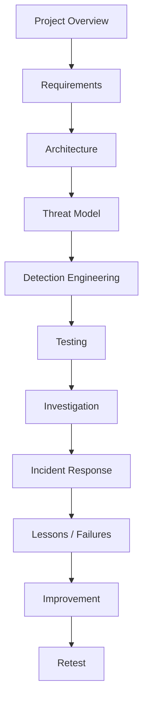

# SENTINEL Documentation

This directory contains the engineering documentation for SENTINEL, covering project objectives, requirements, architecture, threat modeling, detection engineering, incident response, testing, and lessons learned.

This is **not** the main project README — the repository root has its own `README.md` for a general audience. This file is the index for everything under `/docs`.

---

## 1. Documentation Purpose

SENTINEL's documentation is designed to preserve two things at once:

- What the project is **supposed to do**
- What the project **actually does**

It exists to support engineering, security testing, troubleshooting, incident investigation, detection development, validation, future maintenance, technical interviews, and portfolio evidence.

Three rules govern all of it:

- Documentation reflects actual project state.
- Planned capabilities are never presented as implemented.
- Failed experiments are never hidden.

---

## 2. Documentation Structure

| # | Document | Purpose |
|---|---|---|
| 01 | `01-project-overview.md` | What SENTINEL is, its purpose, core question, lifecycle, design philosophy, roadmap, and major concepts |
| 02 | `02-requirements.md` | Hardware, software, networking, storage, virtualization, security, and repository requirements |
| 03 | `03-architecture.md` | Actual infrastructure, VMs, network topology, components, trust boundaries, telemetry flow, future expansion |
| 04 | `04-threat-model.md` | Assets, threats, attack surfaces, trust boundaries, attacker capabilities, security objectives, threat scenarios |
| 05 | `05-detection-engineering.md` | How SENTINEL designs, tests, tunes, validates, and improves detections |
| 06 | `06-incident-response.md` | How SENTINEL handles a detected security event, from detection through response and improvement |
| 07 | `07-testing-and-matrices.md` | How SENTINEL proves its security controls actually work — the main validation methodology |
| 08 | `08-lessons-and-failures.md` | Real project failures, troubleshooting, engineering decisions, and lessons learned |

### 01-project-overview.md
Defines what SENTINEL is, its purpose, core question, lifecycle, design philosophy, roadmap, and major concepts. Core question:

> "Does the detection still work when the attacker changes tactics?"

### 02-requirements.md
Defines the hardware, software, networking, storage, virtualization, security, and repository requirements needed to operate SENTINEL.

### 03-architecture.md
Documents the actual SENTINEL infrastructure, virtual machines, network topology, components, trust boundaries, telemetry flow, and future expansion.

### 04-threat-model.md
Defines assets, threats, attack surfaces, trust boundaries, attacker capabilities, security objectives, and threat scenarios relevant to SENTINEL.

### 05-detection-engineering.md
Defines how SENTINEL designs, tests, tunes, validates, and improves security detections:

```
Threat → Attack Scenario → Telemetry → Detection Logic → Alert →
Investigation → Validation → Measurement → Tuning → Retest
```

### 06-incident-response.md
Defines how SENTINEL handles a detected security event:

```
Detection → Triage → Investigation → Containment → Eradication →
Recovery → Post-Incident Review → Detection Improvement → Retest
```

### 07-testing-and-matrices.md
Defines how SENTINEL proves that security controls actually work. This is the main validation methodology, covering test cases, test matrices, telemetry validation, detection validation, investigation validation, response testing, regression testing, false-positive testing, false-negative testing, metrics, purple-team validation, attack mutation, and detection resilience. Core principle:

> "Configured does not mean validated."

### 08-lessons-and-failures.md
Documents real project failures, troubleshooting, engineering decisions, lessons learned, corrective actions, and retesting. Core principle:

> "Failure is data."

---

## 3. How the Documents Connect

```
Project Overview
      ↓
Requirements
      ↓
Architecture
      ↓
Threat Model
      ↓
Detection Engineering
      ↓
Testing & Matrices
      ↓
Incident Response
      ↓
Lessons & Failures
      ↓
Improvement → Retest
```

In practice: the **Threat Model** identifies what could happen. **Detection Engineering** defines how it should be detected. **Testing & Matrices** determines whether the detection actually works. **Incident Response** defines what happens after a real detection fires. **Lessons & Failures** records what went wrong and what was learned along the way. The resulting improvement then gets retested — closing the loop back into Detection Engineering and Testing.

---

## 4. SENTINEL Engineering Loop

Development philosophy:

```
BUILD → UNDERSTAND → TEST → BREAK → FIX → MEASURE → DOCUMENT → EXPLAIN
```

Security-operation loop:

```
SIMULATE → DETECT → INVESTIGATE → RESPOND → MEASURE → IMPROVE → RETEST
```

Future extension (v0.6):

```
MUTATE → RETEST DETECTION RESILIENCE
```

---

## 5. Current Project State

### Infrastructure

| Host | OS | IP | Role |
|---|---|---|---|
| SENTINEL-WAZUH | Ubuntu 24.04, Wazuh 4.14.8 | 10.10.10.10 | SOC / monitoring platform |
| SENTINEL-KALI | Kali Linux | 10.10.10.20 | Controlled attacker system |
| SENTINEL-LINUX01 | Ubuntu 24.04.5 LTS, Wazuh Agent 4.14.8 (Agent ID 001, Active) | 10.10.10.40 | Monitored Linux endpoint |

**Network:** `SENTINEL-LAB` — `10.10.10.0/24`.

### v0.1 accomplishments
- Core virtual infrastructure established
- Wazuh operational
- Kali operational
- Linux01 operational
- Lab network established
- Linux01 Wazuh Agent connected

### Current work
- Linux telemetry validation
- Detection engineering preparation
- Testing preparation

### Not yet completed
- First controlled detection scenario
- Validated detection results
- Full incident investigation
- Incident response case
- Purple-team measurement
- Attack mutation testing

None of the items above are treated as implemented until they are actually validated and documented in their respective files.

---

## 6. Version Roadmap

| Version | Focus | Documentation Emphasis |
|---|---|---|
| v0.1 | Foundation | Requirements, Architecture |
| v0.2 | Detection Engineering & Linux Telemetry | Detection Engineering, Testing & Matrices |
| v0.3 | SOC Investigation | Incident Response, Testing & Matrices |
| v0.4 | Incident Response | Incident Response |
| v0.5 | Purple-Team Measurement & Validation | Testing & Matrices, Lessons & Failures |
| v0.6 | Attack DNA & Mutation | Detection Engineering, Testing & Matrices |
| v1.0 | Integrated SENTINEL | All documents, consolidated |

Documentation evolves alongside implementation — a document is updated when the underlying capability actually changes, not ahead of it.

---

## 7. Document Ownership / Update Rules

| Document | Update when... |
|---|---|
| 01 Project Overview | Project direction, scope, architecture philosophy, or roadmap changes |
| 02 Requirements | Hardware/software/network/resource requirements change |
| 03 Architecture | Infrastructure, networking, components, or data flow changes |
| 04 Threat Model | New assets, attack surfaces, threats, or security assumptions are introduced |
| 05 Detection Engineering | Detection methodology, telemetry strategy, detection logic, or validation approach changes |
| 06 Incident Response | Investigation, containment, eradication, recovery, or response workflows change |
| 07 Testing & Matrices | Tests are created, executed, failed, validated, or retired |
| 08 Lessons & Failures | A meaningful failure, engineering decision, or lesson occurs |

Not every document needs to change with every version — only the documents actually affected by a given change are updated.

---

## 8. Document Status Model

Documentation may use these labels: `CURRENT`, `IMPLEMENTED`, `IN PROGRESS`, `PLANNED`, `FUTURE`, `UNKNOWN`, `NOT YET TESTED`. Planned functionality is never presented as completed.

---

## 9. Evidence

Implementation claims are eventually backed by evidence stored under:

```
evidence/
├── v0.1/
├── v0.2/
├── v0.3/
├── v0.4/
├── v0.5/
└── v0.6/
```

Evidence may include screenshots, Wazuh alerts, logs, test results, detection configurations, investigation notes, incident timelines, metrics, and before/after comparisons. Secrets, credentials, private keys, VM disks, and sensitive raw telemetry are never committed.

---

## 10. Failure Documentation

Failures are part of SENTINEL's engineering history, tracked in:

```
failure-log/
├── detection-failures.md
├── false-positives.md
├── mutation-failures.md
└── infrastructure-issues.md
```

Failures are captured honestly and follow:

```
Failure → Analysis → Fix → Retest → Lesson
```

No fictional failures are recorded anywhere in this project.

---

## 11. Testing Principle

> SENTINEL does not consider a security control successful merely because it exists.

```
Implementation → Test → Evidence → Measurement → Retest
```

A successful screenshot is not equivalent to validated security coverage.

---

## 12. Future Documentation

Additional documentation may be introduced later if the project's complexity justifies it — for example: DFIR methodology, threat-hunting missions, custom SENTINEL console architecture, API documentation, automation design, deception/honeypot documentation, Windows/AD architecture, or detection coverage reports.

**None of these documents currently exist.** New documentation is added only when it's actually needed, not for its own sake.

---

## 13. Contribution / Maintenance Principles

1. Document real implementation.
2. Separate current from planned.
3. Record important failures.
4. Record evidence.
5. Avoid unnecessary duplication.
6. Update affected documents when architecture changes.
7. Use consistent terminology.
8. Do not fabricate metrics.
9. Do not hide failed tests.
10. Keep documentation understandable to someone who did not build the system.

---

## 14. Reading Order

These are suggested paths, not mandatory ordering.

**New Developer:**
`01 → 02 → 03 → 04 → 05 → 07 → 06 → 08`

**Security / SOC Reviewer:**
`01 → 03 → 04 → 05 → 07 → 06`

**Interviewer:**
`01 → 03 → 05 → 07 → 08`

---

## 15. Documentation Map



---

## 16. Relationship to Root README

| | Root `README.md` | `docs/README.md` (this file) | Individual docs |
|---|---|---|---|
| Audience | General / portfolio visitor | Anyone navigating `/docs` | Engineers, reviewers, interviewers going deep |
| Contents | Project introduction, purpose, architecture summary, key capabilities, quick-start orientation | Documentation index, engineering documentation map, current documentation state, reading paths, document relationships | Detailed engineering information for that specific area |

This file does not duplicate the root README's content — it exists purely to help someone find and navigate the detailed documents.

---

## 17. Project Philosophy

SENTINEL is not built around collecting tools. It is built around answering one question:

> "Can we prove that our defenses work?"

The documentation exists to make that proof understandable, reproducible, evidence-based, testable, honest, and continuously improvable.

---

## 18. Final Status

**Documentation currently includes:**

- 01 Project Overview
- 02 Requirements
- 03 Architecture
- 04 Threat Model
- 05 Detection Engineering
- 06 Incident Response
- 07 Testing & Matrices
- 08 Lessons & Failures

**Current project phase:** v0.1 — Foundation

**Next implementation focus:** v0.2 — Linux Telemetry & Detection Engineering

This file is an **index and navigation guide** for the SENTINEL engineering documentation. It does not invent implementation results, does not claim planned functionality is complete, and does not duplicate the detailed contents of the individual documents.
