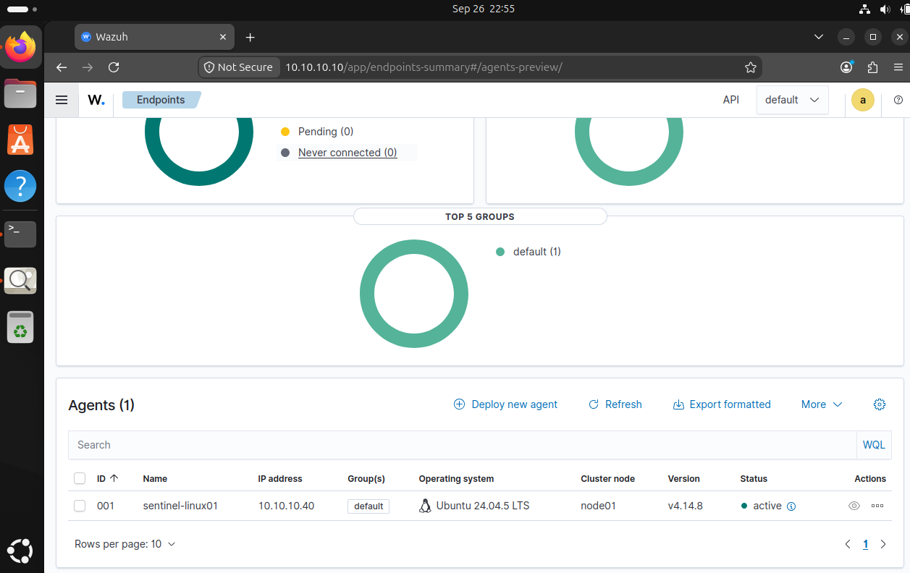
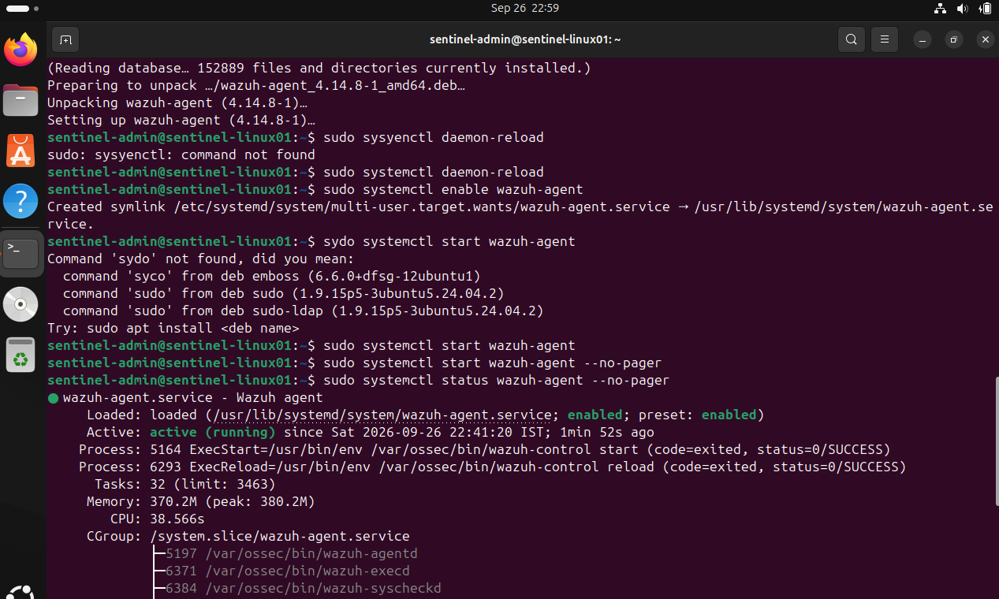
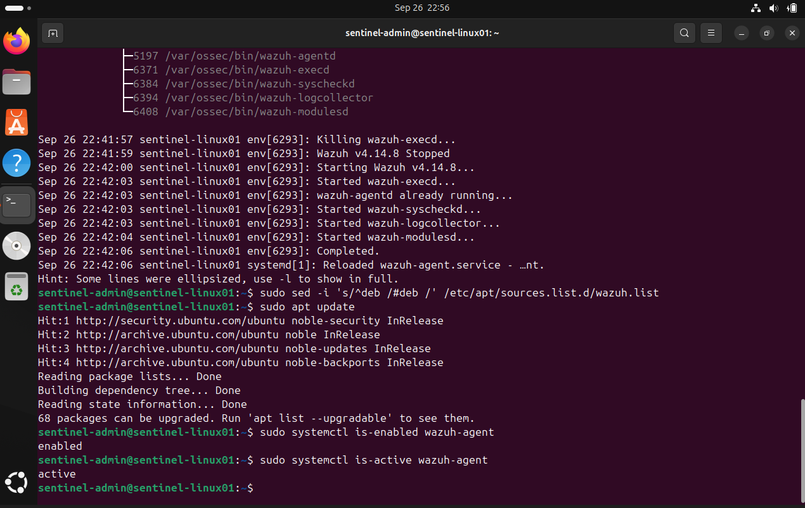

# SENTINEL Evidence — v0.1 (Foundation)

This folder contains the evidence collected during SENTINEL's v0.1 milestone: standing up the core SOC infrastructure and connecting the first monitored endpoint to Wazuh.

**What v0.1 set out to prove:** the lab infrastructure is real, reachable, and actually reporting telemetry — not just configured on paper.

---

## What was verified

| Component | What it shows |
|---|---|
| Wazuh Dashboard | SENTINEL-WAZUH is deployed and the SOC platform is reachable and operational |
| Wazuh Agent status | SENTINEL-LINUX01's agent is registered, active, and reporting to the SOC |
| Infrastructure verification | The lab network and endpoint connectivity work end to end |

**Environment at the time of capture:**
- SENTINEL-WAZUH — Ubuntu 24.04, Wazuh 4.14.8, `10.10.10.10`
- SENTINEL-LINUX01 — Ubuntu 24.04.5 LTS, Wazuh Agent 4.14.8, Agent ID `001`, `10.10.10.40`
- Network: `SENTINEL-LAB` — `10.10.10.0/24`

---

## Evidence

### 1. Wazuh Agent — Active and Connected

The Wazuh Dashboard showing SENTINEL-LINUX01 (Agent ID `001`) registered and reporting a status of **Active**. This confirms the agent successfully enrolled with the Wazuh Manager and is sending telemetry.

### 2. Wazuh Agent Service — Running on the Endpoint

The Wazuh Agent service running on SENTINEL-LINUX01 itself, confirming the agent is installed, enabled, and healthy from the endpoint side — not just reporting as active from the dashboard's perspective.

### 3. Final Infrastructure Verification

A final check confirming the lab components — SENTINEL-WAZUH and SENTINEL-LINUX01 — are connected over the `SENTINEL-LAB` network as intended, closing out v0.1.

---

## What this evidence does *not* claim

To keep this honest: these screenshots confirm infrastructure and connectivity only. They do **not** demonstrate a detection firing, an investigation, an incident response action, or any measured security outcome. That work starts in v0.2 (Linux telemetry and detection engineering) and will get its own evidence folder once it exists.

---

**Status:** v0.1 — Foundation, completed
**Next:** v0.2 — Linux Telemetry & Detection Engineering
