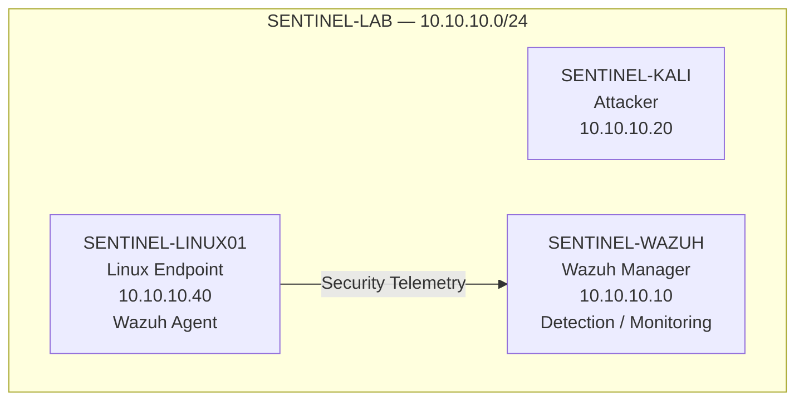
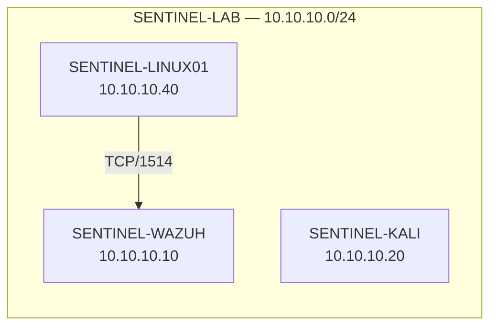
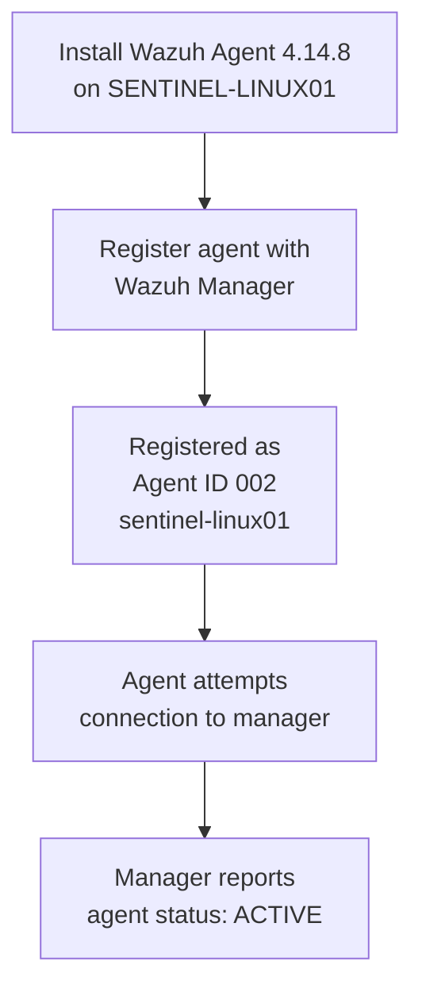
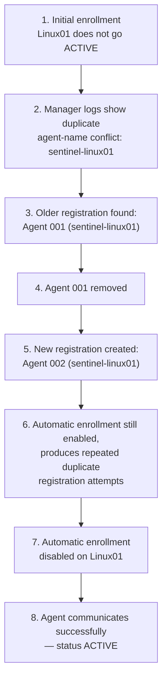
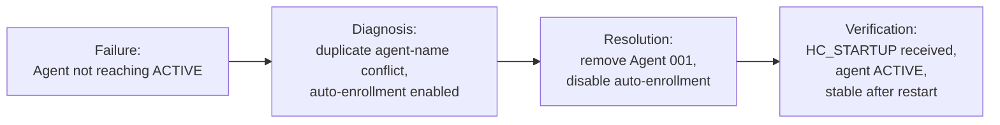
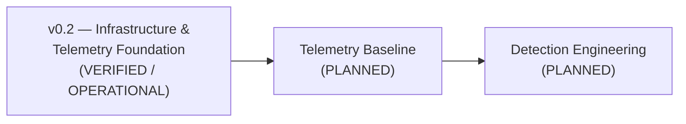

# SENTINEL v0.2 — Infrastructure & Telemetry Foundation

**Status:** VERIFIED / OPERATIONAL (infrastructure and telemetry foundation only — see [16. Current Status](#16-current-status))

---

## 1. Title

SENTINEL v0.2 — Infrastructure & Telemetry Foundation

## 2. Executive Summary

SENTINEL is an isolated cybersecurity SOC laboratory built to simulate a small enterprise, generate controlled activity, collect security telemetry, engineer detections, investigate incidents, respond to threats, measure detection performance, and continuously retest detection resilience:

```
SIMULATE → DETECT → INVESTIGATE → RESPOND → MEASURE → IMPROVE → RETEST
```

This document covers the **v0.2 — Initial Detection & Telemetry Foundation** milestone. The infrastructure needed for telemetry collection has been established: the monitored Linux endpoint (`SENTINEL-LINUX01`) is enrolled with the Wazuh Manager (`SENTINEL-WAZUH`), agent communication is active, and endpoint telemetry is flowing. This milestone also covers a real duplicate-agent-registration issue encountered during enrollment, how it was diagnosed, and how it was resolved.

**This milestone does not mean detection engineering is complete.** It establishes the foundation detection engineering will be built on next.

## 3. Milestone Objective

Establish and verify a working telemetry pipeline between a monitored Linux endpoint and the Wazuh Manager, so that future detection-engineering work has a confirmed, operational source of endpoint data to build against.

## 4. Current Architecture



**Diagram caption:** Current SENTINEL-LAB topology. SENTINEL-KALI is deployed as the attacker/adversary-emulation system but was not involved in generating the telemetry verified in this milestone. SENTINEL-LINUX01 is the monitored endpoint, sending security telemetry to the SENTINEL-WAZUH manager over the isolated lab network. No components beyond these three systems are part of the current implementation.

## 5. Infrastructure Components

| System | Role | Lab IP | Notes |
|---|---|---|---|
| SENTINEL-WAZUH | Wazuh Manager / SOC monitoring and detection platform | `10.10.10.10` | — |
| SENTINEL-LINUX01 | Monitored Linux endpoint | `10.10.10.40` | Ubuntu 24.04, Wazuh Agent 4.14.8 |
| SENTINEL-KALI | Attacker / adversary-emulation VM | `10.10.10.20` | Not involved in this milestone's verified activity |

All systems sit on the isolated lab network **SENTINEL-LAB** (`10.10.10.0/24`).

## 6. Network Topology



**Diagram caption:** Verified communication path between SENTINEL-LINUX01 (`10.10.10.40`) and SENTINEL-WAZUH (`10.10.10.10`) over TCP port 1514, confirmed during troubleshooting. SENTINEL-KALI is shown on the same lab network but was not part of this connectivity test.

## 7. Wazuh Agent Integration

SENTINEL-LINUX01 was enrolled as a Wazuh agent against SENTINEL-WAZUH. Integration was confirmed through:

- Registration of the agent in the Wazuh Manager's agent list.
- Receipt of an `HC_STARTUP` control message by the manager from `sentinel-linux01` (source `10.10.10.40`).
- Processing of endpoint security telemetry by the manager, including Security Configuration Assessment (SCA) activity tied to the CIS Ubuntu 24.04 policy.
- An `ACTIVE` agent status, confirmed both initially and after a subsequent manager/agent restart.

**Final registered agent:**

| Field | Value |
|---|---|
| Agent ID | `002` |
| Agent name | `sentinel-linux01` |
| Final state | `ACTIVE` |

## 8. Enrollment Process



**Diagram caption:** Enrollment flow for the SENTINEL-LINUX01 Wazuh agent, from installation to confirmed `ACTIVE` status with the manager.

## 9. Troubleshooting Incident

During initial enrollment, SENTINEL-LINUX01 could not reach an `ACTIVE` state.



**Diagram caption:** Troubleshooting timeline for the duplicate agent-registration issue encountered during SENTINEL-LINUX01's enrollment, from initial failure through to resolution.

**Sequence of events:**

1. The Linux endpoint failed to reach `ACTIVE` status on initial enrollment.
2. Wazuh Manager logs showed a duplicate agent-name conflict for `sentinel-linux01`.
3. An older registration was found to already exist as **Agent 001**.
4. Agent 001 was removed.
5. A subsequent registration created **Agent 002**.
6. Automatic enrollment was still enabled on the endpoint by default, which continued attempting registration while Agent 002 already existed — producing repeated duplicate-registration messages.
7. Automatic enrollment was disabled on SENTINEL-LINUX01, since the endpoint was already manually registered.
8. The agent subsequently established communication with the manager successfully and reached `ACTIVE` status.

> **Note:** This is documented as an actual troubleshooting event observed in this specific SENTINEL environment. It is not presented as a generic or universal Wazuh behavior, since it has not been cross-verified against official Wazuh documentation.

## 10. Root Cause

A duplicate agent-name conflict — a pre-existing registration (Agent 001, `sentinel-linux01`) combined with automatic enrollment still being enabled on the endpoint — caused repeated duplicate-registration attempts once a second registration (Agent 002) was created, preventing the agent from reaching a stable `ACTIVE` state.

**Contributing factor:** automatic enrollment was left enabled after the agent had already been manually registered.

This root cause is reported as specific to what was observed in this environment, not as a generalized claim about Wazuh's default behavior across deployments.

## 11. Resolution



**Diagram caption:** Failure → diagnosis → resolution → verification flow for the duplicate-enrollment incident.

1. Removed the stale Agent 001 registration.
2. Confirmed the new registration as Agent 002 (`sentinel-linux01`).
3. Disabled automatic enrollment on SENTINEL-LINUX01.
4. Enabled temporary verbose debugging to confirm the fix:
   - Wazuh Manager: `remoted.debug=2`
   - Linux01 Agent: `agent.debug=2`
5. Confirmed the manager received `HC_STARTUP` from `sentinel-linux01` and began processing endpoint telemetry.
6. Removed the temporary debug configuration once resolution was confirmed.
7. Restarted both the Wazuh Manager and the Linux01 agent.
8. Confirmed the agent remained `ACTIVE` after the restart.

## 12. Verification

| Check | Result |
|---|---|
| Linux01 enrolled with Wazuh Manager | ✅ Verified |
| Agent ID / name | ✅ `002` / `sentinel-linux01` |
| Agent status | ✅ `ACTIVE` |
| Network connectivity (10.10.10.40 → 10.10.10.10) | ✅ Verified |
| TCP port 1514 communication | ✅ Verified during troubleshooting |
| `HC_STARTUP` received by manager | ✅ Confirmed in manager debug output |
| Endpoint SCA/CIS Ubuntu 24.04 telemetry observed | ✅ Confirmed |
| Agent remained `ACTIVE` after manager + agent restart | ✅ Confirmed |
| Temporary debug settings removed | ✅ Confirmed |

No packet counts, latency figures, or other quantitative performance data were captured during this milestone — none are reported here.

## 13. SCA Telemetry Evidence

**SCA** stands for **Security Configuration Assessment**. Wazuh was observed processing SCA activity associated with the CIS Ubuntu 24.04 policy, sourced from SENTINEL-LINUX01.

This matters as supporting evidence because it shows the endpoint was not merely registered in name — Wazuh was actively receiving and processing endpoint security-assessment telemetry from it. SCA activity here is **supporting evidence for the infrastructure milestone**, not a custom detection capability: no custom Wazuh detection rule was created or tested as part of this milestone.

## 14. Security Considerations

- Internal lab IP addresses (`10.10.10.0/24` range) are documented, as they are isolated-lab-internal and not sensitive.
- **No Wazuh administrator credentials are included anywhere in this document.**
- **No contents of `/var/ossec/etc/client.keys` are included anywhere in this document.**
- No API keys, authentication tokens, private keys, certificates, session tokens, or `.env` file contents are included.
- Temporary debug logging (`remoted.debug=2`, `agent.debug=2`) was removed after troubleshooting and is not part of the standing configuration.
- Any screenshot captured for this milestone must be reviewed before publication; if it shows a password, credential, key, or token, **redact it before adding it to the repository.**

### Security / redaction checklist

- [ ] No Wazuh admin or dashboard password visible
- [ ] No `client.keys` contents visible
- [ ] No API keys, authentication tokens, or session tokens visible
- [ ] No private key or certificate secret material visible
- [ ] No `.env` file contents visible
- [ ] No unrelated host, browser, or personal information visible in the background
- [ ] Internal lab IPs (`10.10.10.x`) confirmed acceptable to leave visible

## 15. Evidence Summary

Evidence is separated by what it demonstrates, without implying supporting evidence outweighs the confirmed operational state.

**Primary verification** (confirms the system is actually working):
- Agent `ACTIVE`
- Manager operational
- Agent operational
- Network connectivity confirmed
- `HC_STARTUP` received by the manager

**Supporting evidence** (context for how that state was reached):
- SCA/CIS Ubuntu 24.04 telemetry processing
- Duplicate-enrollment failure and its diagnosis
- Troubleshooting debug output
- Troubleshooting timeline

### Evidence checklist

- [ ] Wazuh Dashboard — Agent 002 (`sentinel-linux01`) listed with status `ACTIVE`
- [ ] Manager log/debug excerpt showing `HC_STARTUP` from `sentinel-linux01` *(redacted as needed)*
- [ ] Manager log excerpt showing the duplicate agent-name conflict (Agent 001 vs. new registration)
- [ ] Confirmation Agent 001 was removed (dashboard or CLI output)
- [ ] SCA/CIS Ubuntu 24.04 telemetry evidence received by the manager
- [ ] Post-restart dashboard view confirming Agent 002 remained `ACTIVE`
- [ ] Confirmation that temporary debug settings were reverted

### Recommended screenshots and captions

1. **Wazuh Dashboard — agent list.** Caption: "SENTINEL-LINUX01 registered as Agent 002, status ACTIVE."
2. **Agent detail view.** Caption: "Agent 002 detail view showing enrollment date, last keep-alive, and agent version 4.14.8."
3. **Manager log — duplicate registration conflict.** Caption: "Manager log excerpt showing the duplicate agent-name conflict that initially prevented sentinel-linux01 from reaching ACTIVE status. (Redacted as needed.)"
4. **Manager log — HC_STARTUP.** Caption: "Manager debug output confirming receipt of HC_STARTUP from sentinel-linux01 at 10.10.10.40."
5. **Post-restart dashboard view.** Caption: "Agent 002 confirmed ACTIVE after the Wazuh Manager and agent were restarted following the fix."

Store captured evidence under `evidence/v0.2/`, applying the redaction checklist above before committing anything.

## 16. Current Status

**SENTINEL v0.2 — Infrastructure & Telemetry Foundation**
**STATUS: VERIFIED / OPERATIONAL**

Verified:
- ✅ Linux01 configured
- ✅ Wazuh Agent installed
- ✅ Agent successfully enrolled
- ✅ Agent ID 002 registered
- ✅ Agent ACTIVE
- ✅ Wazuh ↔ Linux01 communication verified
- ✅ HC_STARTUP received
- ✅ Endpoint SCA telemetry observed
- ✅ Duplicate enrollment issue diagnosed
- ✅ Duplicate enrollment issue resolved
- ✅ Temporary debug logging removed
- ✅ Manager restarted
- ✅ Agent restarted
- ✅ Agent remained ACTIVE

**NOT yet complete (FUTURE / PLANNED):**
- ⏳ Controlled telemetry baseline experiments
- ⏳ Custom Wazuh detection rules
- ⏳ Detection testing
- ⏳ Detection tuning
- ⏳ False-positive analysis
- ⏳ Incident investigation workflow
- ⏳ Incident response workflow
- ⏳ Detection metrics
- ⏳ Purple-team measurement
- ⏳ Attack mutation
- ⏳ Attack DNA

None of the items in this list should be read as implemented based on this document.

## 17. Next Phase



With a confirmed, operational telemetry pipeline between SENTINEL-LINUX01 and SENTINEL-WAZUH, the next step is a controlled telemetry baseline — observing what normal and controlled-test activity looks like in Wazuh — followed by initial custom detection engineering. Neither has started yet.

---

## Build summary

**Recommended document title:** SENTINEL v0.2 — Infrastructure & Telemetry Foundation

**Recommended filename:** `docs/09-v0.2-infrastructure-and-telemetry.md`

**GitHub commit message:**
```
docs(v0.2): document infrastructure & telemetry foundation milestone
```

**CHANGELOG entry:**
```markdown
## [0.2.0] - Unreleased
### Infrastructure / Telemetry
- Enrolled SENTINEL-LINUX01 as a Wazuh agent (Agent ID 002, sentinel-linux01); verified ACTIVE status, HC_STARTUP receipt, and endpoint SCA/CIS Ubuntu 24.04 telemetry processing by SENTINEL-WAZUH.
### Troubleshooting
- Diagnosed and resolved a duplicate agent-name registration conflict (stale Agent 001) caused by automatic enrollment remaining enabled after manual registration; disabled automatic enrollment on Linux01 and confirmed stable ACTIVE status after a manager/agent restart.
```
