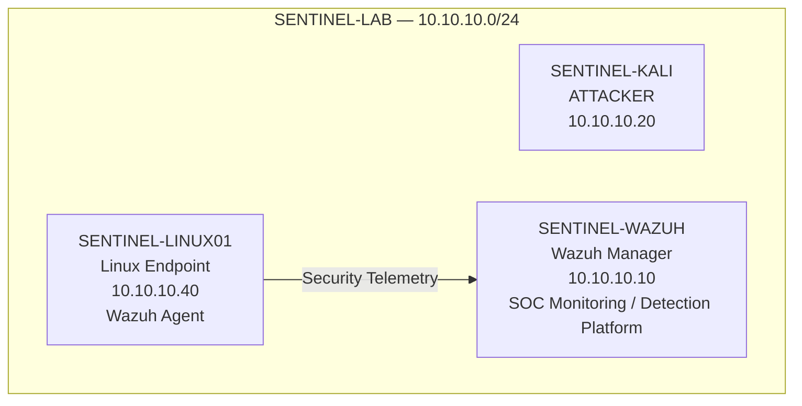
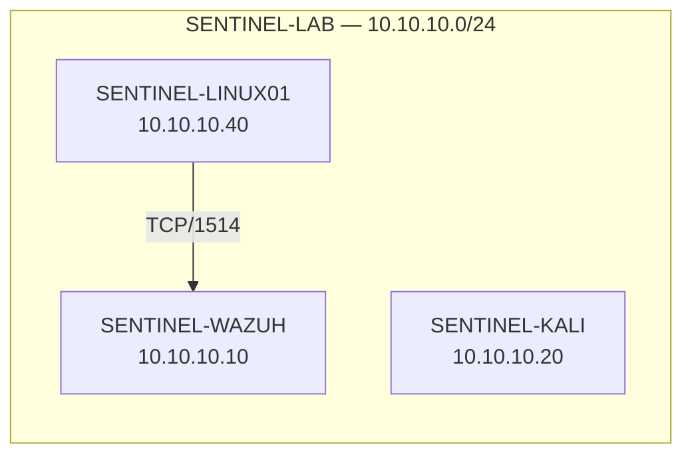
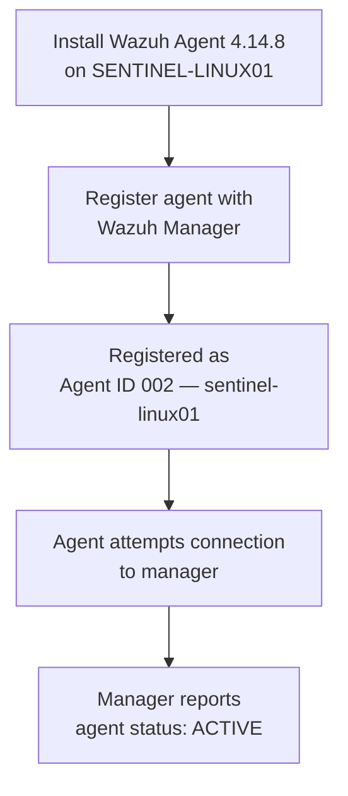
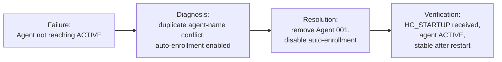

# SENTINEL v0.2 — Infrastructure & Telemetry Foundation

## 1. Executive Summary

SENTINEL is an isolated cybersecurity SOC laboratory designed to simulate a small enterprise environment, generate controlled security activity, collect telemetry, engineer detections, investigate incidents, respond to threats, measure detection performance, and continuously test detection resilience:

```
SIMULATE → DETECT → INVESTIGATE → RESPOND → MEASURE → IMPROVE → RETEST
```

This document covers the **v0.2 — Initial Infrastructure & Telemetry Foundation** milestone: enrolling the monitored Linux endpoint (`SENTINEL-LINUX01`) with the Wazuh Manager (`SENTINEL-WAZUH`) and establishing verified, active agent-to-manager communication. It also documents a real duplicate-agent-registration issue encountered during enrollment, its root cause, and its resolution.

> **Important:** this milestone establishes the endpoint-to-SOC communication foundation only. It does **not** mean the complete v0.2 detection-engineering phase is finished.

## 2. Milestone Objective

Establish and verify a working telemetry pipeline between a monitored Linux endpoint and the Wazuh Manager, so that detection engineering has a confirmed, operational source of endpoint data to build against.

## 3. Current Architecture



This reflects the currently implemented architecture only: SENTINEL-KALI (attacker), SENTINEL-LINUX01 (monitored endpoint), and SENTINEL-WAZUH (manager), connected over the isolated SENTINEL-LAB network. No Windows, Active Directory, cloud services, databases, SOAR tooling, or other components are part of this verified milestone.

## 4. Infrastructure Components

| System | Role | Lab IP | Notes |
|---|---|---|---|
| SENTINEL-WAZUH | Wazuh Manager / SOC monitoring and detection platform | `10.10.10.10` | — |
| SENTINEL-LINUX01 | Monitored Linux endpoint | `10.10.10.40` | Ubuntu 24.04, Wazuh Agent 4.14.8 |
| SENTINEL-KALI | Attacker / adversary-emulation VM | `10.10.10.20` | Not involved in this milestone's verified activity |

All systems sit on the isolated lab network **SENTINEL-LAB** (`10.10.10.0/24`).

## 5. Network Topology



> **Evidence:** Network connectivity between Linux01 (`10.10.10.40`) and Wazuh (`10.10.10.10`)
> `[Insert screenshot: v0.2-linux01-to-wazuh-connectivity.png]`

TCP communication to Wazuh Manager port 1514 was verified during troubleshooting. No packet counts or latency figures were captured, and none are reported here.

## 6. Wazuh Agent Integration

SENTINEL-LINUX01 was enrolled as a Wazuh agent against SENTINEL-WAZUH. The final registered agent:

| Field | Value |
|---|---|
| Agent ID | `002` |
| Agent name | `sentinel-linux01` |
| Final state | `ACTIVE` |

> **Evidence:** Final Wazuh agent status
> `[Insert screenshot: v0.2-agent-active.png]`

> **Evidence:** Wazuh Manager operational status
> `[Insert screenshot: v0.2-wazuh-manager-running.png]`

> **Evidence:** Linux01 Wazuh Agent operational status
> `[Insert screenshot: v0.2-linux01-agent-running.png]`

## 7. Enrollment Process



## 8. Troubleshooting Incident

### 8.1 Initial Symptom

During initial enrollment, SENTINEL-LINUX01 could not reach an `ACTIVE` state.

### 8.2 Investigation

Wazuh Manager logs showed a duplicate agent-name conflict involving `sentinel-linux01`. An older registration was found to already exist as **Agent 001**. Agent 001 was removed, and a subsequent enrollment created **Agent 002**. Automatic enrollment then continued attempting registration while Agent 002 already existed, producing repeated duplicate-registration messages.

Temporary verbose debugging was enabled to investigate further — see [Section 10](#10-debugging-and-cleanup).

> **Evidence:** Duplicate agent enrollment failure (troubleshooting artifact, not final-state evidence)
> `[Insert screenshot: v0.2-enrollment-failure.png]`

### 8.3 Root Cause

A duplicate agent-name conflict — a pre-existing registration (Agent 001, `sentinel-linux01`) combined with automatic enrollment still being enabled on the endpoint — caused repeated duplicate-registration attempts once a second registration (Agent 002) was created, which prevented the agent from reaching a stable `ACTIVE` state.

**Contributing factor:** automatic enrollment was left enabled after the agent had already been manually registered.

> This is documented as what was actually observed in this SENTINEL environment, not presented as a generic or universal Wazuh behavior, since it has not been cross-verified against official Wazuh documentation.

### 8.4 Resolution

1. Removed the stale Agent 001 registration.
2. Confirmed the new registration as Agent 002 (`sentinel-linux01`).
3. Disabled automatic enrollment on SENTINEL-LINUX01, since the endpoint was already manually registered.
4. Confirmed the manager received `HC_STARTUP` from `sentinel-linux01` and began processing endpoint telemetry (see [Section 9](#9-telemetry-verification)).
5. Removed the temporary debug configuration.
6. Restarted both the Wazuh Manager and the Linux01 agent.
7. Confirmed the agent remained `ACTIVE` after the restart.

### 8.5 Final Verification



Final state: Agent `002`, `sentinel-linux01`, status `ACTIVE`.

## 9. Telemetry Verification

### 9.1 HC_STARTUP

Wazuh debug output confirmed receipt of an `HC_STARTUP` message from agent `sentinel-linux01` at `10.10.10.40`.

> **Evidence:** HC_STARTUP received by Wazuh
> `[Insert screenshot: v0.2-wazuh-hc-startup.png]`

### 9.2 SCA / CIS Telemetry

**SCA** stands for **Security Configuration Assessment**. Wazuh was observed processing SCA activity associated with the CIS Ubuntu 24.04 policy, sourced from SENTINEL-LINUX01.

This is supporting evidence that the endpoint was not merely registered — Wazuh was actively processing security-assessment telemetry from it. SCA activity here is **supporting telemetry evidence for this infrastructure milestone**, not a custom SENTINEL detection rule, and detection engineering is not claimed to be complete.

> **Evidence:** SCA/CIS telemetry processing
> `[Insert screenshot: v0.2-sca-telemetry-processing.png]`

## 10. Debugging and Cleanup

Temporary verbose debugging was enabled during troubleshooting to obtain additional information about the failed communication/enrollment state:

| Component | Setting |
|---|---|
| Wazuh Manager | `remoted.debug=2` |
| Linux01 Agent | `agent.debug=2` |

After troubleshooting was successful:

- `remoted.debug=2` was removed.
- `agent.debug=2` was removed.
- The Wazuh Agent was restarted.
- The Wazuh Manager was restarted.
- Agent status was verified as `ACTIVE`.

Verbose debugging is **not** part of the final, intended configuration.

## 11. Security Considerations

- Credentials are excluded from this document.
- Authentication keys are excluded.
- The contents of `/var/ossec/etc/client.keys` are never reproduced.
- API tokens and private keys are excluded.
- Wazuh administrator credentials are never reproduced.
- Screenshots referenced above must be reviewed for secrets before committing; redact anything that exposes a password, key, or token.
- Internal lab IP addresses (`10.10.10.0/24` range) are documented because they belong to the isolated SENTINEL environment.

## 12. Evidence

### Primary Evidence

1. Final Wazuh agent status — ID `002`, name `sentinel-linux01`, status `ACTIVE`.
2. Wazuh Manager operational status.
3. Linux01 Wazuh Agent operational status.
4. Network connectivity verification (Linux01 ↔ Wazuh).
5. `HC_STARTUP` received by Wazuh.

### Supporting Evidence

6. SCA/CIS Ubuntu 24.04 telemetry processing.
7. Duplicate agent enrollment failure (troubleshooting artifact).

Screenshot placeholders referenced in this document:

- `v0.2-agent-active.png`
- `v0.2-wazuh-manager-running.png`
- `v0.2-linux01-agent-running.png`
- `v0.2-linux01-to-wazuh-connectivity.png`
- `v0.2-wazuh-hc-startup.png`
- `v0.2-sca-telemetry-processing.png`
- `v0.2-enrollment-failure.png`

These file paths are placeholders only; none are assumed to already exist in the repository.

## 13. Current Status

**v0.2 Infrastructure & Telemetry Foundation**
**STATUS: VERIFIED / OPERATIONAL**

Verified:
- ✓ Linux01 configured
- ✓ Wazuh Agent installed
- ✓ Agent successfully enrolled
- ✓ Agent ID 002 registered
- ✓ Agent ACTIVE
- ✓ Wazuh ↔ Linux01 communication verified
- ✓ HC_STARTUP received
- ✓ Endpoint SCA telemetry observed
- ✓ Duplicate enrollment issue diagnosed
- ✓ Duplicate enrollment issue resolved
- ✓ Temporary debug logging removed
- ✓ Manager restarted
- ✓ Agent restarted
- ✓ Agent remained ACTIVE after restart

**NEXT PHASE / PLANNED (not yet implemented):**
- Controlled telemetry baseline experiments
- Custom Wazuh detection rules
- Detection testing
- Detection tuning
- False-positive analysis
- Incident investigation workflow
- Incident response workflow
- Detection metrics
- Purple-team measurement
- Attack DNA
- Attack mutation

## 14. Next Phase

The next practical step is a **controlled telemetry baseline**: generating controlled activity on SENTINEL-LINUX01 and observing what telemetry Wazuh actually receives.

```
CONTROLLED ACTIVITY
        ↓
WAZUH TELEMETRY
        ↓
RAW EVENT INSPECTION
        ↓
UNDERSTAND EVENT FIELDS
        ↓
DETECTION ENGINEERING
        ↓
TEST
        ↓
TUNE
```

This experiment has not yet been performed.
