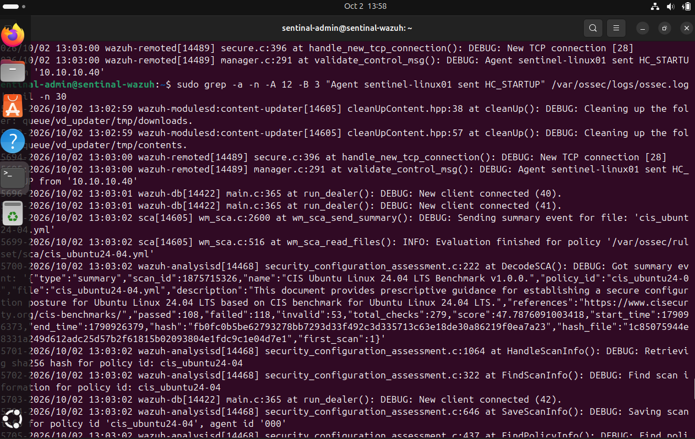
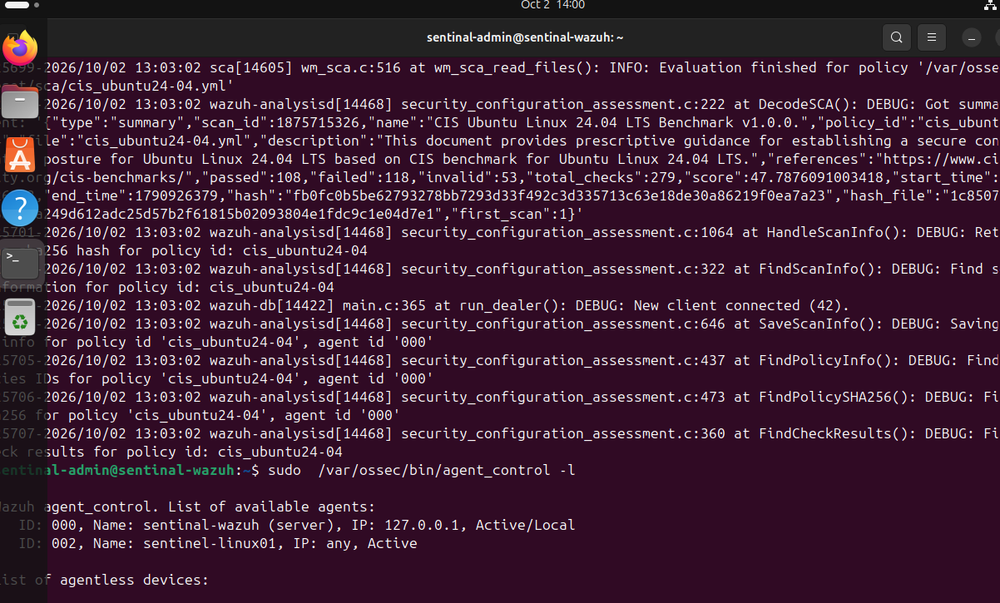
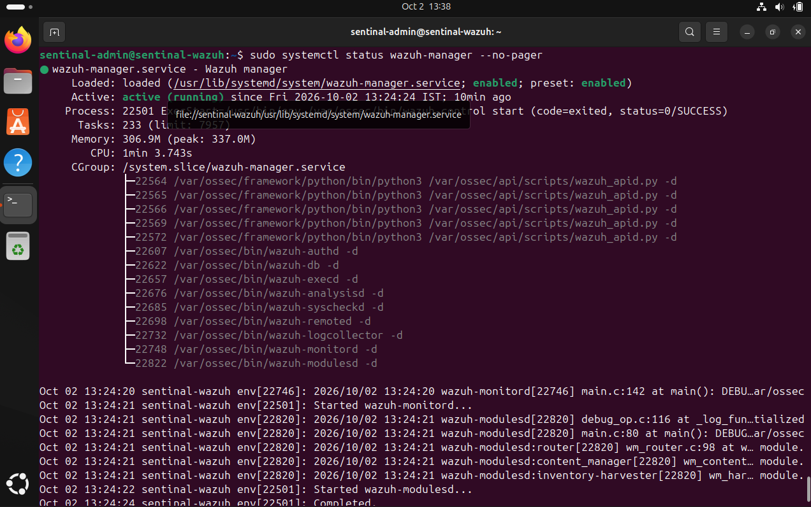
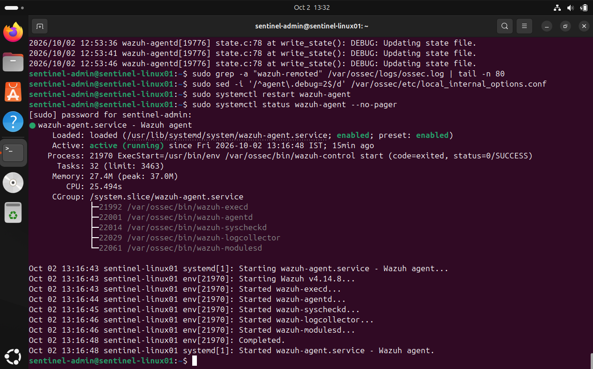
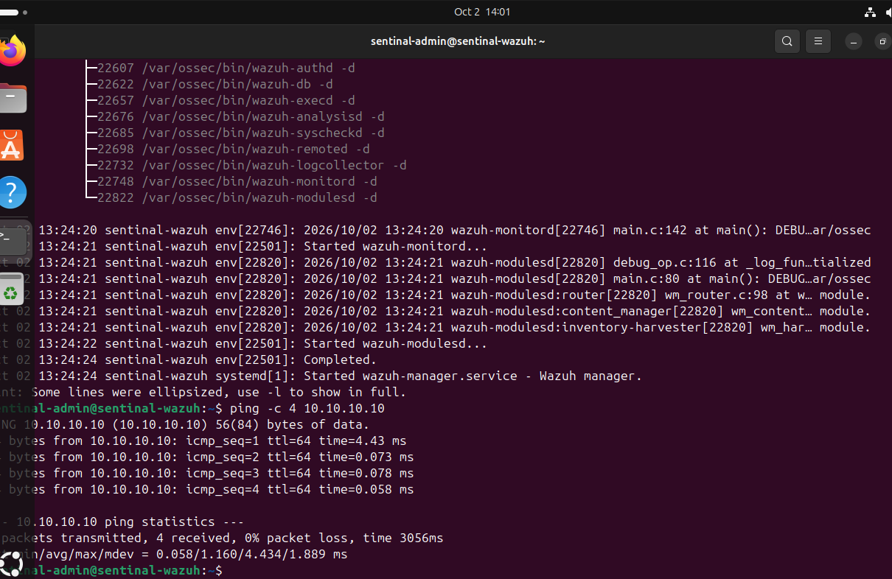
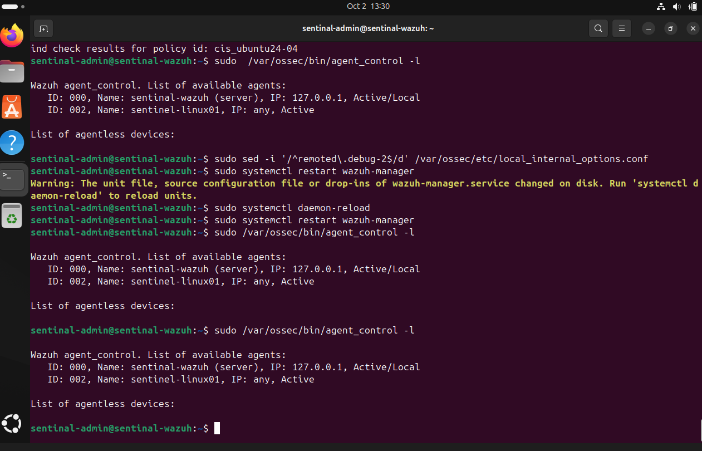

# SENTINEL Evidence — v0.2 (Infrastructure & Telemetry Foundation)

This folder contains the evidence collected while bringing up the Wazuh↔SENTINEL-LINUX01 telemetry pipeline: manager health, agent enrollment, and confirmed connectivity between the endpoint and the SOC platform.

**What this evidence set proves:** the Wazuh Manager is running and healthy, the agent on SENTINEL-LINUX01 is installed and running, and the two are actually talking to each other — not just configured to.

---

## What was verified

| Component | What it shows |
|---|---|
| Wazuh Manager health check & startup | The Wazuh Manager service started cleanly and passed its health checks |
| Wazuh Manager running | The manager process is up and operational on SENTINEL-WAZUH |
| Agent running on SENTINEL-LINUX01 | The Wazuh Agent service is installed, enabled, and running on the endpoint |
| Linux01 ↔ Wazuh connectivity | The endpoint and the manager can actually reach each other over the network |
| Agent active in dashboard | The Wazuh Dashboard shows the agent enrolled and reporting status **Active** |

See `infrastructure-and-telemetry-foundation.md` and `wazuh-linux01-integration.md` in this folder for the full write-up behind this evidence.

---

## Evidence

### 1. Wazuh Manager — Health Check & Startup

The Wazuh Manager's startup sequence and health check, confirming the manager service came up without errors.

### 2. Wazuh Manager — Running

Confirmation that the Wazuh Manager process is active and running on SENTINEL-WAZUH.

### 3. Wazuh Agent — Running on SENTINEL-LINUX01

The Wazuh Agent service running on the SENTINEL-LINUX01 endpoint itself, confirming it's installed and operating correctly from the agent side.

### 4. SENTINEL-LINUX01 ↔ Wazuh Connectivity

Confirms that SENTINEL-LINUX01 can reach SENTINEL-WAZUH over the `SENTINEL-LAB` network — the actual communication path the agent depends on.

### 5. Agent — Active in the Wazuh Dashboard

The Wazuh Dashboard showing the agent enrolled and reporting a status of **Active**, confirming the full pipeline — agent → network → manager → dashboard — is working end to end.

---

## What this evidence does *not* claim

This evidence confirms infrastructure and telemetry connectivity only. It does **not** demonstrate a detection firing, an investigation, an incident response action, or any measured security outcome — that work is still ahead and will get its own evidence once it exists.

---

**Status:** v0.2 — Infrastructure & Telemetry Foundation, verified
**Related write-ups:** `infrastructure-and-telemetry-foundation.md`, `wazuh-linux01-integration.md`
