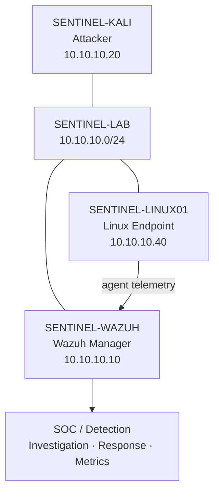
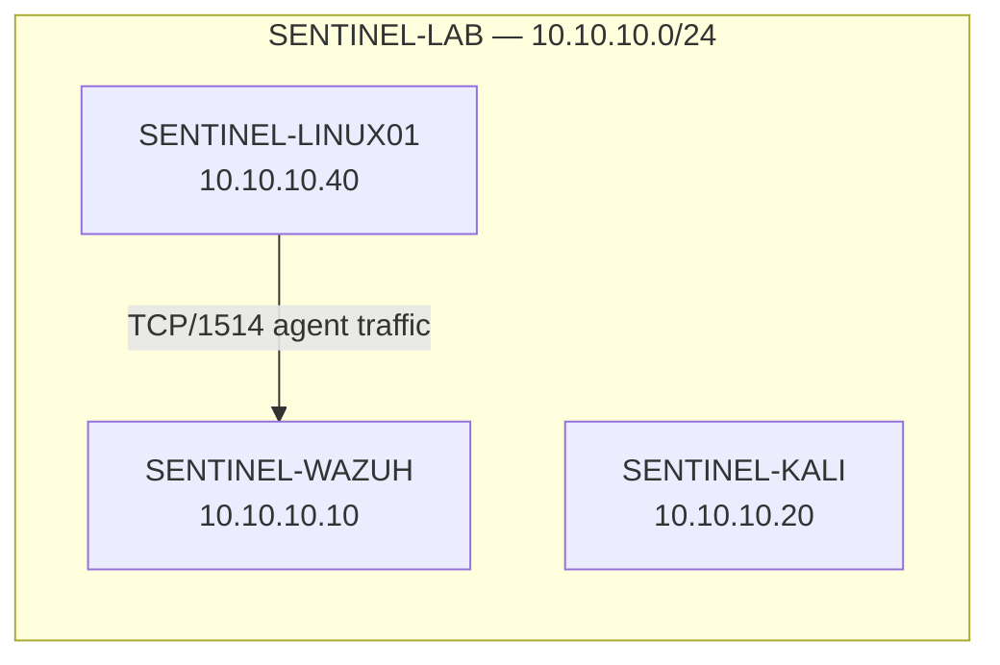
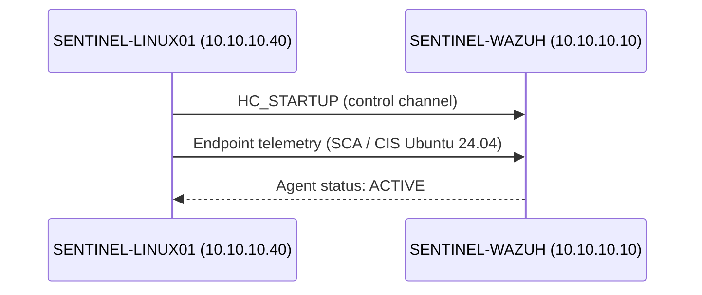
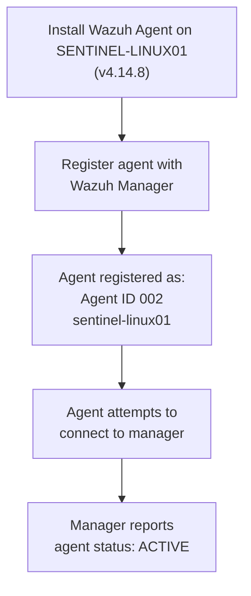
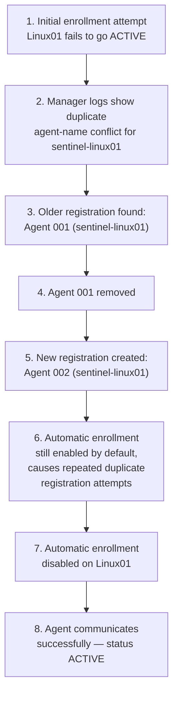
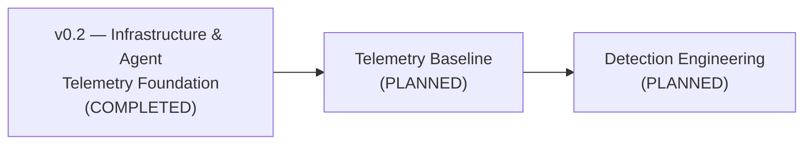

# SENTINEL — Wazuh ↔ Linux01 Integration (v0.2 Infrastructure / Telemetry Foundation)

**Status:** COMPLETED (infrastructure/telemetry foundation only — see [Current Status](#13-current-status))

---

## 1. Executive Summary

SENTINEL is a cybersecurity SOC lab built inside an isolated virtual environment, designed to simulate attacks, collect telemetry, engineer detections, investigate incidents, respond to incidents, measure detection performance, improve defenses, and retest them:

```
SIMULATE → DETECT → INVESTIGATE → RESPOND → MEASURE → IMPROVE → RETEST
```

This document covers the **v0.2 Infrastructure / Telemetry Foundation** milestone: enrolling the Linux endpoint (`SENTINEL-LINUX01`) with the Wazuh Manager (`SENTINEL-WAZUH`), establishing active agent communication, and resolving a real duplicate-registration issue encountered along the way. It covers what was built, what broke, how the break was diagnosed and fixed, and what evidence confirms the fix — the groundwork detection engineering will build on next.

---

## 2. SENTINEL Architecture



This is the intended initial architecture for SENTINEL's core lab. `SENTINEL-KALI` and `SENTINEL-LINUX01` sit on the same isolated lab network as `SENTINEL-WAZUH`; the Linux endpoint sends agent telemetry to the Wazuh Manager, which feeds the future SOC functions (detection, investigation, response, metrics).

---

## 3. Infrastructure Components

| System | Role | Lab IP | Notes |
|---|---|---|---|
| SENTINEL-WAZUH | Wazuh Manager / SOC monitoring platform | `10.10.10.10` | — |
| SENTINEL-LINUX01 | Linux endpoint / monitored target | `10.10.10.40` | Ubuntu 24.04, Wazuh Agent v4.14.8 |
| SENTINEL-KALI | Attacker / adversary-emulation VM | `10.10.10.20` | Not involved in this milestone's verification activity |

All systems communicate over the isolated lab network, **SENTINEL-LAB**.

---

## 4. Network Topology



Connectivity between `10.10.10.40` (Linux01) and `10.10.10.10` (Wazuh) was verified. TCP communication to the relevant Wazuh services was tested during troubleshooting; TCP 1514 specifically was tested. No packet-count or latency figures were recorded during this milestone, and none are claimed here.

---

## 5. Wazuh–Linux01 Integration

SENTINEL-LINUX01 was enrolled as a Wazuh agent against SENTINEL-WAZUH. The integration was confirmed through:

- Registration of the agent in the Wazuh Manager's agent list.
- The manager receiving an `HC_STARTUP` control message from `sentinel-linux01`.
- The manager processing endpoint security telemetry from the agent, including Security Configuration Assessment / CIS Ubuntu 24.04 activity.
- The agent's status reporting as `ACTIVE`, including after a manager/agent restart.

### Final verified communication path



---

## 6. Agent Enrollment Process



The currently registered agent for this endpoint is:

- **Agent ID:** `002`
- **Agent name:** `sentinel-linux01`
- **Final status:** `ACTIVE`

---

## 7. Troubleshooting Incident

During enrollment, `SENTINEL-LINUX01` initially could not reach an `ACTIVE` state.

### Timeline



**Sequence of events:**

1. The Linux endpoint failed to become `ACTIVE` on initial enrollment.
2. Wazuh Manager logs showed a duplicate agent-name conflict involving `sentinel-linux01`.
3. An older agent registration was found to already exist as **Agent 001**.
4. Agent 001 was removed.
5. A subsequent registration created **Agent 002**.
6. Automatic enrollment on the agent side was still enabled by default, which caused repeated duplicate-registration attempts since Agent 002 already existed.
7. Automatic enrollment was disabled on `SENTINEL-LINUX01`, since registration had already been completed manually.
8. After this change, the agent communicated successfully with the manager.

> **Note:** This behavior is documented as what was observed in this specific SENTINEL environment, not asserted as a generic, universal Wazuh rule. It has not been cross-checked against official Wazuh documentation as part of this milestone.

---

## 8. Root Cause

**Root cause:** A duplicate agent-name conflict — an existing registration (Agent 001, `sentinel-linux01`) combined with automatic enrollment still being enabled on the endpoint — caused repeated duplicate-registration attempts once a second registration (Agent 002) was created, preventing the agent from reaching a stable `ACTIVE` state.

**Contributing factor:** Automatic enrollment being left enabled by default after manual agent registration had already occurred.

This is reported as the specific, observed cause in this environment, not a general claim about Wazuh's behavior across all deployments.

---

## 9. Resolution

1. Removed the stale Agent 001 registration.
2. Confirmed the new registration as Agent 002 (`sentinel-linux01`).
3. Disabled automatic enrollment on `SENTINEL-LINUX01`, since the agent was already manually registered.
4. Enabled temporary verbose debugging to confirm behavior during resolution:
   - Wazuh Manager: `remoted.debug=2`
   - Linux01 Agent: `agent.debug=2`
5. Confirmed the manager received `HC_STARTUP` from `sentinel-linux01` and began processing endpoint telemetry.
6. Removed the temporary debug configuration once the issue was confirmed resolved.
7. Restarted both the Wazuh Manager and the Linux01 agent.
8. Confirmed the agent remained `ACTIVE` after the restart.

---

## 10. Verification

| Check | Result |
|---|---|
| Linux01 enrolled with Wazuh Manager | ✅ Verified |
| Agent ID / name | ✅ `002` / `sentinel-linux01` |
| Agent status | ✅ `ACTIVE` |
| Network connectivity (10.10.10.40 → 10.10.10.10) | ✅ Verified |
| TCP communication to Wazuh services (TCP 1514 tested) | ✅ Verified during troubleshooting |
| `HC_STARTUP` received by manager | ✅ Confirmed in manager debug output |
| Endpoint security telemetry observed (SCA / CIS Ubuntu 24.04) | ✅ Confirmed |
| Agent remained `ACTIVE` after manager + agent restart | ✅ Confirmed |
| Temporary debug settings removed | ✅ Confirmed |

No packet counts, latency measurements, or other quantitative performance data were captured during this milestone, so none are reported here.

---

## 11. Security Considerations

- Lab IP addresses (`10.10.10.0/24` range) are documented, as they are internal to the isolated SENTINEL-LAB network and not sensitive.
- **No Wazuh admin passwords are included anywhere in this document.**
- **No contents of `client.keys` are included anywhere in this document.**
- No authentication tokens, private keys, or session secrets are included.
- Temporary debug logging (`remoted.debug=2`, `agent.debug=2`) was removed after troubleshooting and is not part of the standing configuration.
- Any screenshots captured to accompany this milestone must be reviewed before committing; if a screenshot shows a password, API key, token, private key, or other secret, **redact it before adding it to the repository** rather than committing it as-is.

### Redaction checklist (apply before committing any screenshot or log excerpt)

- [ ] No Wazuh admin or dashboard password visible
- [ ] No `client.keys` contents visible
- [ ] No API keys, tokens, or session identifiers visible
- [ ] No private key material visible
- [ ] No hostnames/usernames beyond what's already documented here (lab-internal IPs are fine)
- [ ] No unrelated host/browser information visible in the background of a screenshot

---

## 12. Evidence Requirements

The following evidence supports the claims in this document. Only items that actually exist should be linked; do not reference evidence that was not captured.

### Evidence checklist

- [ ] Wazuh Dashboard — Agent 002 (`sentinel-linux01`) listed with status `ACTIVE`
- [ ] Wazuh Manager log/debug excerpt showing `HC_STARTUP` received from `sentinel-linux01` *(redact any surrounding sensitive lines)*
- [ ] Wazuh Manager log excerpt showing the duplicate agent-name conflict (Agent 001 vs. new registration)
- [ ] Confirmation that Agent 001 was removed (dashboard or CLI output)
- [ ] Endpoint security telemetry evidence (SCA / CIS Ubuntu 24.04 check activity received by manager)
- [ ] Post-restart dashboard view confirming Agent 002 remained `ACTIVE`
- [ ] Confirmation that temporary debug settings (`remoted.debug`, `agent.debug`) were reverted

### Recommended screenshots

1. Wazuh Dashboard agent list showing `sentinel-linux01` / Agent ID `002` / status `ACTIVE`.
2. Agent detail view for Agent 002 (enrollment date, last keep-alive, version).
3. Manager log excerpt showing the duplicate-registration conflict (redacted as needed).
4. Manager log excerpt showing `HC_STARTUP` from `sentinel-linux01`.
5. Dashboard view after the manager/agent restart, showing the agent is still `ACTIVE`.

Store evidence under the appropriate version directory in `evidence/` (e.g. `evidence/v0.2/`), following the redaction checklist above before committing anything.

---

## 13. Current Status

**v0.2 Infrastructure / Telemetry Foundation — STATUS: COMPLETED**

Verified:
- ✅ Linux01 installed and configured
- ✅ Wazuh Agent installed
- ✅ Agent successfully enrolled
- ✅ Agent ID 002 registered
- ✅ Agent status ACTIVE
- ✅ Wazuh ↔ Linux01 communication verified
- ✅ `HC_STARTUP` received by Wazuh
- ✅ Endpoint security telemetry observed
- ✅ Enrollment issue diagnosed
- ✅ Duplicate registration issue resolved
- ✅ Temporary debug logging removed
- ✅ Manager and Agent restarted successfully
- ✅ Agent remained ACTIVE after restart

**NOT yet completed (FUTURE / PLANNED):**
- ⏳ Controlled telemetry baseline experiments
- ⏳ Detection engineering
- ⏳ Custom Wazuh detection rules
- ⏳ Detection testing
- ⏳ False-positive tuning
- ⏳ Incident investigation workflow
- ⏳ Response automation
- ⏳ Detection metrics
- ⏳ Attack mutation testing

None of the items in the "not yet completed" list should be read as implemented based on this document — they are explicitly future work.

---

## 14. Next Stage: Telemetry Baseline



With the Wazuh ↔ Linux01 telemetry pipeline confirmed active, the next step is to establish a controlled telemetry baseline — observing what normal and controlled-test activity looks like in Wazuh before any custom detection logic is built. This baseline work, along with initial detection engineering, is planned and has not yet started.
